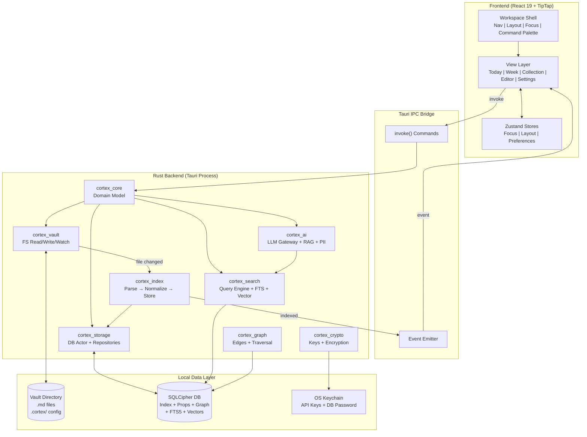
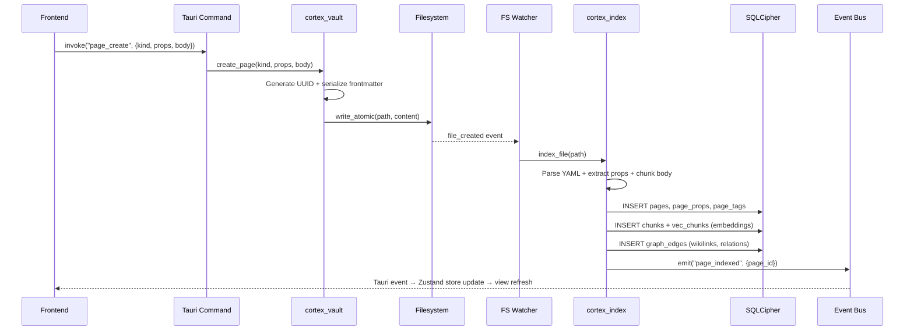
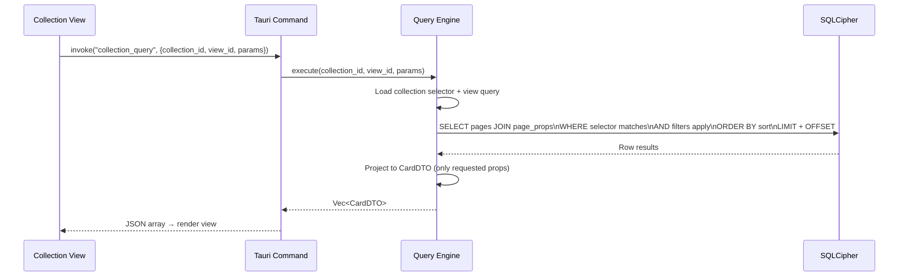
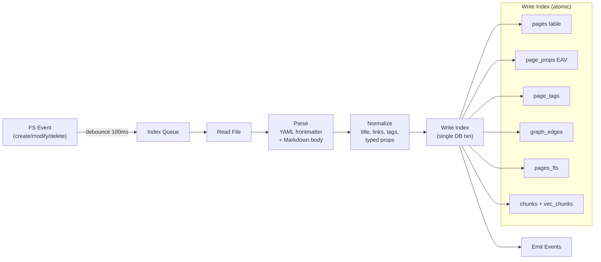

# Cortex Life OS — Architecture

**Status:** Draft v1 (annotated with Phase 0 divergences)
**Date:** 2026-02-18  
**Scope:** System architecture, data model, stack, conventions  
**Companion docs:** `002_COLLECTIONS.md`, `003_TASKS_AND_PLANNING.md`, `004_AI_INTEGRATION.md`

---

## 0) Design Thesis

Cortex is a **local-first Life OS** that treats every entity — task, event, trip, account, workout, note — as a **Markdown page with typed frontmatter properties**. A Rust backend indexes these pages into an encrypted SQLite database that powers fast queries, full-text search, vector retrieval, and graph traversal. The frontend renders **Collection Views** (gallery, table, board, calendar, map) over this unified data model.

**Core invariants:**

1. **Vault files are the source of truth.** The database is derived and deletable.
2. **Everything is a Page.** No separate entity tables. A task, a trip, and a journal entry are all `.md` files differentiated by `kind` in frontmatter.

> **Phase 0 Divergence:** The frontend uses domain-specific TypeScript interfaces (`Task`, `Goal`, `JournalEntry`, `Meal`, `Recipe`, etc.) rather than a unified Page model. Each domain has its own type with bespoke fields. The backend will normalize these to the Page model internally. See `000_OVERVIEW.md` §7 FE-AD-04, `005_TYPE_RECONCILIATION.md`.

3. **Collections + Views are the universal abstraction.** "Travel," "Finance," and "Tasks" are configured collections, not bespoke modules.
4. **Human-in-the-loop for AI writes.** The AI proposes; the user approves. No autonomous vault modifications.

> **Phase 0 Divergence:** The frontend's AI agent actions (`addTask`, `addGoal`, `addJournalEntry`, `searchBrain`) execute CRUD immediately via Gemini function-calling with no approval queue. The Morning Review HITL pattern is deferred to Phase 4. See ADR-0005.

5. **Works out of the box.** All components bundle with the installer. No external services required for core functionality.

---

## 1) Stack

| Layer | Technology | Role |
|-------|-----------|------|
| **App Shell** | Tauri v2 (Rust + native WebView) | Desktop container, IPC bridge, system APIs, FS access, background threads |
| **Frontend** | React 19 + TypeScript + Vite | UI rendering, view routing, client state |
| **Editor** | TipTap (ProseMirror) | Block-based WYSIWYG Markdown editor with custom node extensions |
| **Styling** | TailwindCSS + shadcn/ui | Component library, theming |
| **Client State** | Zustand | UI state, open files, preferences, focus model |
| **Database** | SQLite + SQLCipher (rusqlite) + FTS5 | Encrypted page index, properties, graph edges, revision history |
| **Vector Search** | sqlite-vec (bundled extension) | Embedded vector similarity search, no external daemon |
| **FS Watch** | notify crate (Rust) | Real-time vault change detection |
| **LLM Local** | Ollama (HTTP bridge to localhost) | Local inference + embeddings |
| **LLM Cloud** | Provider HTTP APIs | OpenAI, Anthropic, Google via BYOK keys |
| **LLM Gateway** | Rust abstraction layer | Provider-agnostic routing, streaming, token accounting |
| **STT (Local)** | whisper-rs (whisper.cpp bindings) | Bundled offline speech-to-text, GGML models. See ADR-0013 |
| **PII Shield** | Rust regex patterns (v1); ONNX NER (later) | Client-side PII redaction before cloud calls |
| **Crypto** | SQLCipher + argon2 + ring | DB encryption, key derivation, encrypted API key storage |
| **Maps** | Leaflet + OpenStreetMap (v1); Google Maps (later) | Embedded map views in editor and collection layouts |
| **Graph Viz** | d3-force on HTML Canvas | Interactive knowledge graph rendering (5k node target) |

> **Phase 0 Reality:** The following stack items are **not yet implemented**: Tauri (App Shell), TipTap (Editor), TailwindCSS + shadcn/ui (Styling), Zustand (Client State), SQLite/SQLCipher (Database), sqlite-vec (Vector Search), FS Watch (notify crate), Ollama (LLM Local), LLM Gateway (Rust), PII Shield, Crypto, Maps (Leaflet), Graph Viz (d3), whisper-rs (STT Local). The frontend runs as a standalone Vite + React 19 web app with custom CSS variables for theming. AI integration uses the `@google/genai` SDK directly from the browser. State lives in `App.tsx` `useState`. Data is in-memory via `dataService.ts`. See `000_OVERVIEW.md` §7 FE-AD-01 (state), FE-AD-02 (mock data), FE-AD-03 (Gemini direct calls).

### Crate Structure (Rust Backend)

```
crates/
  cortex_core/        # Domain model: Page, Property, Collection, View
  cortex_storage/     # SQLite/SQLCipher, migrations, repositories, DB Actor
  cortex_vault/       # Filesystem adapter: read/write/watch, parsing
  cortex_index/       # Indexing pipeline: frontmatter → EAV, FTS5, embeddings
  cortex_search/      # Query engine: collection_query(), FTS, vector, graph
  cortex_graph/       # Link extraction, graph edges, traversal
  cortex_ai/          # LLM gateway, RAG pipeline, PII shield, token accounting, voice pipeline (whisper-rs STT, configurable TTS)
  cortex_crypto/      # Key derivation, API key encryption, SQLCipher config
src-tauri/
  main.rs             # Tauri commands + events (thin layer over crates)
  commands/           # Grouped command modules (vault, collections, ai, etc.)
ui/
  src/
    components/       # Shared UI components
    views/            # Page-level views (Today, Week, Collection, Editor, Settings)
    services/         # Tauri invoke wrappers (replaces dataService.ts)
    stores/           # Zustand stores (focus, layout, preferences)
    editor/           # TipTap extensions and config
```

---

## 2) Unified Data Model

### 2.1 Page (The Universal Entity)

Every entity in Cortex is a Markdown file. Structure:

```markdown
---
id: pg_01JF8K...
kind: task
status: TODO
priority: HIGH
due: 2026-03-01
project: /Projects/Cortex.md
tags: [engineering, backend]
created: 2026-02-18T10:00:00Z
modified: 2026-02-18T10:00:00Z
---
# Implement DB Actor pattern

Set up the dedicated blocking thread with tokio::sync::mpsc channels
for all SQLite operations.

## Notes
- Reference the rusqlite connection pooling docs
- Benchmark with 1000 concurrent reads
```

**Rules:**
- `id` is a stable UUID, assigned on first index, stored in frontmatter (Option B from the arch discussion — travel with the file for portability)
- `kind` determines which Collection(s) the page belongs to
- `tags` are first-class and indexed
- `created` / `modified` are maintained by the backend
- The Markdown body is free-form content
- Frontmatter is the structured data layer

### 2.2 Property System

Properties are typed key/value pairs in YAML frontmatter:

| Type | YAML Example | SQLite Storage |
|------|-------------|----------------|
| `text` | `destination: "Tokyo"` | `value_text` |
| `number` | `budget_usd: 3500` | `value_num` |
| `date` | `due: 2026-03-01` | `value_date` (ISO 8601) |
| `datetime` | `start: 2026-02-20T09:00` | `value_date` |
| `select` | `status: TODO` | `value_text` (validated against schema options) |
| `multi_select` | `tags: [a, b, c]` | Multiple rows in EAV |
| `boolean` | `done: true` | `value_num` (0/1) |
| `relation` | `project: /Projects/X.md` | `value_text` (path or page_id) |
| `url` | `link: "https://..."` | `value_text` |
| `currency` | `amount: 150.00` | `value_num` + `currency: USD` |
| `location` | `location: "40.71,-74.00"` | `value_text` (lat,lng string) |
| `location_name` | `location_name: "NYC"` | `value_text` |

### 2.3 SQLite Schema (Index — Derived from Vault)

> **Canonical schema.** Per ADR-0006, this EAV/Page schema is the production schema. The flat domain tables in `backend/docs/backend_architecture/001_SCHEMA.md` are superseded. See `docs/adrs/ADR-0006-schema-strategy.md`.

```sql
-- Page registry
CREATE TABLE pages (
    page_id         TEXT PRIMARY KEY,   -- UUID from frontmatter
    path            TEXT NOT NULL UNIQUE,
    title           TEXT,
    kind            TEXT,               -- task, event, trip, account, note, etc.
    content_hash    TEXT,               -- blake3 hash for change detection
    frontmatter_json TEXT,              -- raw JSON for round-tripping
    body_text       TEXT,               -- plain text body (for FTS source)
    created_at      TEXT,
    modified_at     TEXT,
    indexed_at      TEXT
);

-- Typed property index (EAV — fast filtering/sorting)
CREATE TABLE page_props (
    page_id     TEXT NOT NULL REFERENCES pages(page_id) ON DELETE CASCADE,
    key         TEXT NOT NULL,
    prop_type   TEXT NOT NULL,          -- text, number, date, select, etc.
    value_text  TEXT,
    value_num   REAL,
    value_date  TEXT,
    PRIMARY KEY (page_id, key, value_text) -- composite for multi_select
);
CREATE INDEX idx_props_key_text ON page_props(key, value_text);
CREATE INDEX idx_props_key_num ON page_props(key, value_num);
CREATE INDEX idx_props_key_date ON page_props(key, value_date);

-- Tag index (denormalized from multi_select for speed)
CREATE TABLE page_tags (
    page_id TEXT NOT NULL REFERENCES pages(page_id) ON DELETE CASCADE,
    tag     TEXT NOT NULL,
    PRIMARY KEY (page_id, tag)
);
CREATE INDEX idx_tags_tag ON page_tags(tag);

-- Graph edges (links, relations, AI-suggested)
CREATE TABLE graph_edges (
    source_id   TEXT NOT NULL,
    target_id   TEXT NOT NULL,
    edge_type   TEXT NOT NULL,          -- wikilink, relation, ai_suggested, tag_co
    weight      REAL DEFAULT 1.0,
    provenance  TEXT,                   -- model name if AI-suggested
    created_at  TEXT,
    PRIMARY KEY (source_id, target_id, edge_type)
);
CREATE INDEX idx_edges_target ON graph_edges(target_id);

-- FTS5 index (full-text search over content + titles)
CREATE VIRTUAL TABLE pages_fts USING fts5(
    page_id UNINDEXED,
    title,
    body_text,
    tags,
    content=pages,
    content_rowid=rowid
);

-- Vector embeddings (via sqlite-vec extension)
CREATE VIRTUAL TABLE vec_chunks USING vec0(
    chunk_id TEXT PRIMARY KEY,
    embedding float[384]                -- dimension matches model (nomic-embed-text)
);

-- Chunk metadata
CREATE TABLE chunks (
    chunk_id        TEXT PRIMARY KEY,
    page_id         TEXT NOT NULL REFERENCES pages(page_id) ON DELETE CASCADE,
    heading_path    TEXT,               -- "Note Title > Section > Subsection"
    char_start      INTEGER,
    char_end        INTEGER,
    content_hash    TEXT,               -- for incremental re-embedding
    content_text    TEXT                -- chunk text for retrieval display
);

-- Revision history (diff-per-save)
CREATE TABLE revisions (
    revision_id TEXT PRIMARY KEY,
    page_id     TEXT NOT NULL REFERENCES pages(page_id) ON DELETE CASCADE,
    timestamp   TEXT NOT NULL,
    diff_text   TEXT,                   -- unified diff from previous
    snapshot    TEXT                     -- full content every N revisions
);

-- Collection definitions (also stored in .cortex/collections/*.json)
CREATE TABLE collections (
    collection_id   TEXT PRIMARY KEY,
    name            TEXT NOT NULL,
    icon            TEXT,
    selector_json   TEXT NOT NULL,      -- rules for page membership
    schema_json     TEXT NOT NULL,      -- property schema definition
    config_json     TEXT                -- default view, color, etc.
);

-- View definitions
CREATE TABLE views (
    view_id         TEXT PRIMARY KEY,
    collection_id   TEXT NOT NULL REFERENCES collections(collection_id),
    name            TEXT NOT NULL,
    layout          TEXT NOT NULL,      -- gallery, table, board, calendar, map, list
    query_json      TEXT,               -- filters, sorts, group_by, projection
    config_json     TEXT                -- layout-specific config (column widths, etc.)
);

-- App configuration
CREATE TABLE app_config (
    key     TEXT PRIMARY KEY,
    value   TEXT
);
```

### 2.4 Hybrid Storage Strategy

The **Hybrid JSON + EAV** approach gives us both:

- **EAV table (`page_props`)**: Fast SQL filtering, sorting, grouping across any property key. Powers `collection_query()`.
- **JSON blob (`frontmatter_json`)**: Lossless round-trip back to YAML frontmatter. Preserves unknown/custom keys without schema migration.

On index: parse YAML → store as JSON blob → also decompose into EAV rows for known typed keys.
On write: update YAML frontmatter from canonical property values → write `.md` file → re-index.

### 2.5 Frontmatter Validation Rules

The indexer must handle real-world edge cases gracefully. The vault is user-editable — files may be created in Obsidian, VS Code, or by hand with imperfect frontmatter.

| Condition | Behavior |
|-----------|----------|
| **Missing frontmatter** (no `---` block) | Treat as `kind: note`. Auto-generate `id` (pg_ + ULID) and write it back to the file on first index. |
| **Missing `id` field** | Indexer generates `pg_` + ULID, writes it into the file's YAML block. The ID is stable from that point forward. |
| **Missing `kind` field** | Defaults to `note`. Logged as a warning. Page is still indexed and queryable. |
| **Corrupt / unparseable YAML** | Skip indexing for this file. Surface an error in the UI ("N files failed to index"). Do **not** modify or delete the file. |
| **Duplicate `id`** (two files claim same ID) | Both files are indexed. The indexer logs a conflict warning. Conflict is surfaced in Settings → Vault Health. Resolution is manual (user edits one file). |
| **Unknown properties** | Preserved in `frontmatter_json` blob. Not decomposed to EAV (no `page_props` rows). Queryable via `json_extract()` but not via standard property filters. Survives round-trip writes. |
| **Relation target missing** (e.g., `project: /Projects/Deleted.md`) | Stored as-is in `page_props`. UI shows an "unresolved link" indicator (dimmed, with warning icon). No cascade delete — relations are soft references. |
| **Invalid date format** | Non-ISO-8601 date strings are stored as `value_text` (not `value_date`). Date filters won't match them. UI shows the raw string. |
| **File naming** | On page creation, title is slugified: lowercase, spaces→hyphens, strip special characters (`/\:*?"<>\|`), limit to 200 chars. Collision appends `-1`, `-2`, etc. |
| **Empty body** (frontmatter only, no markdown below) | Valid. Indexed normally. Body content is empty string. |
| **Binary files in vault** | Ignored by indexer. Only `.md` files are indexed. |
| **Symlinks** | Followed if they point to `.md` files within the vault root. Symlinks outside the vault root are ignored. |

**Canonical date format:** ISO 8601. Dates as `YYYY-MM-DD`, datetimes as `YYYY-MM-DDTHH:MM` or `YYYY-MM-DDTHH:MM:SSZ`. The indexer parses these into `value_date` in `page_props`. Any non-conforming string is stored as text only.

**ID format:** `pg_` prefix + 26-character ULID (Universally Unique Lexicographically Sortable Identifier). Example: `pg_01JF8KV2X3...`. ULIDs are preferred over UUIDv4 because they sort chronologically and are URL-safe.

---

## 3) System Architecture



### 3.1 Data Flow: Create a New Page



### 3.2 Data Flow: Collection Query



---

## 4) Indexing Pipeline

### 4.1 Pipeline Stages



### 4.2 Change Detection

- **Content hash (blake3):** On each FS event, hash the file. Skip indexing if hash matches `pages.content_hash`.
- **Chunk-level hashing:** Each chunk has its own `content_hash`. On re-index, only re-embed chunks whose hash changed.
- **Rename detection:** If a path disappears and a new path appears with the same `id` in frontmatter, update `pages.path`. Because we store `id` in frontmatter, renames are trivial.

### 4.3 Startup Behavior

1. Show shell immediately (< 500ms)
2. Background: scan vault, compare file mtimes to `pages.indexed_at`
3. Re-index only stale files
4. Emit `index_progress(stage, pct)` events for UI progress indicator
5. Full re-index only on: first launch, embedding model change, manual trigger, or corrupted index detection

---

## 5) Editor Architecture (TipTap)

### 5.1 Why TipTap

TipTap (built on ProseMirror) gives us block-level extensibility that CodeMirror cannot match. Since Cortex is a Notion-style structured data app (not just a text editor), we need:

- Custom block nodes (map embeds, property tables, task checkboxes, calendar widgets)
- Slash command menu (`/`) for inserting block types
- WYSIWYG rendering of frontmatter as a property panel
- Inline rendering of wiki-links, tags, and math

### 5.2 Extension System

Editor extensions are **toggleable in Settings**. Each extension registers:
- A TipTap `Node` or `Mark` definition
- A serializer/deserializer for Markdown round-trip
- An optional Settings UI panel

| Extension | Default | What It Does |
|-----------|---------|-------------|
| **Math/LaTeX** | ON | Inline `$...$` and block `$$...$$` via KaTeX rendering |
| **Code Blocks** | ON | Syntax-highlighted fenced code blocks (language detection) |
| **Code Linting** | OFF | Optional inline linting hints for code blocks (requires language server config) |
| **Wiki Links** | ON | `[[page name]]` rendered as clickable internal links |
| **Tags** | ON | `#tag` rendered as clickable chips, indexed on save |
| **Task Checkboxes** | ON | `- [ ]` / `- [x]` rendered as interactive checkboxes |
| **Map Embed** | ON | `cortex-map` fenced blocks rendered as interactive Leaflet maps |
| **Mermaid** | OFF | `mermaid` fenced blocks rendered as diagrams |
| **Slash Commands** | ON | `/` menu for inserting any block type |
| **Frontmatter Panel** | ON | YAML frontmatter rendered as a collapsible property editor (not raw YAML) |
| **Table** | ON | GFM tables rendered as interactive table editor |
| **Image Drag-Drop** | ON | Drag images into editor; saved to vault `assets/` folder |
| **Source Toggle** | ON | Toggle between WYSIWYG and raw Markdown source view |

### 5.3 Markdown Round-Trip Strategy

**The `.md` file is always portable CommonMark + YAML frontmatter.** Custom blocks are stored as fenced code blocks with language identifiers:

````markdown
<!-- In the .md file (portable): -->

```cortex-map
lat: 35.6762
lng: 139.6503
zoom: 13
markers:
  - lat: 35.6586
    lng: 139.7454
    label: "Tokyo Tower"
```

<!-- In TipTap (rendered): -->
<!-- → Interactive Leaflet map component -->
````


```

This means:
- Any Markdown editor (Obsidian, VS Code, GitHub) shows the raw YAML — readable, not broken
- Cortex renders it as an interactive widget
- Edits to the widget update the fenced block content
- The serializer handles YAML ↔ node data conversion

### 5.4 Performance Budgets

| Metric | Target |
|--------|--------|
| Keystroke → paint | < 16ms (60fps) |
| Open note (cached) | < 50ms perceived |
| Math render (block) | < 50ms per block, viewport-only |
| Custom block mount (map) | Lazy — mount on scroll into viewport |
| Preview debounce | 150–300ms idle |

---

## 6) IPC Contract (Tauri Commands)

### 6.1 Type Generation

Use `tauri-specta` to auto-generate TypeScript types from Rust structs. The frontend `services/backend.ts` wraps `invoke()` calls with typed signatures. No hand-maintained type duplication.

### 6.2 Command Surface

**Vault**
```
vault_pick_root() -> VaultRef
vault_read(path) -> PageContent
vault_write(path, content) -> WriteResult
vault_create_page(kind, props, body) -> PageRef
vault_delete(page_id) -> ()
vault_move(page_id, new_path) -> ()
vault_list(path) -> FileNode[]
```

**Collections & Views**
```
collections_list() -> Collection[]
collections_get(id) -> Collection
collection_query(collection_id, view_id, params) -> CardDTO[]
collection_query_count(collection_id, filters) -> u64
views_list(collection_id) -> View[]
views_create(collection_id, ViewCreate) -> View
views_update(view_id, ViewUpdate) -> View
```

**Page Properties**
```
page_get(page_id) -> Page
page_update_props(page_id, props) -> Page
page_add_tag(page_id, tag) -> ()
page_remove_tag(page_id, tag) -> ()
page_link(source_id, target_id, edge_type) -> ()
page_unlink(source_id, target_id, edge_type) -> ()
```

**Search**
```
search_global(query, limit, types?) -> SearchResult[]
search_semantic(query, limit) -> SemanticResult[]
search_graph_neighbors(page_id, hops, limit) -> GraphNode[]
```

**AI**
```
ai_chat(model_id, history, context?) -> StreamHandle
ai_summarize(page_id) -> Summary
ai_suggest_links(page_id) -> SuggestedLink[]
ai_rag_query(question) -> RAGResponse
ai_help(question) -> HelpResponse        // Command RAG (docs)
ai_get_providers() -> Provider[]
ai_set_provider_key(provider, encrypted_key) -> ()
ai_get_usage_stats(range?) -> UsageStats
ai_transcribe(audio_b64, mime_type) -> TranscribeResult   // STT: local Whisper or cloud fallback (ADR-0013)
ai_synthesize(text, voice_config?) -> SynthesizeResult    // TTS: configurable provider (ADR-0013)
```

**Settings**
```
settings_get() -> AppSettings
settings_update(partial) -> AppSettings
settings_get_editor_extensions() -> ExtensionConfig[]
settings_toggle_extension(ext_id, enabled) -> ()
```

### 6.3 Event Contract (Backend → Frontend)

```
vault_changed { paths: string[] }
page_indexed { page_id: string }
page_deleted { page_id: string }
collection_invalidated { collection_id: string, view_id?: string }
index_progress { stage: string, current: u64, total: u64 }
ai_stream_chunk { request_id: string, text: string }
ai_stream_done { request_id: string, usage: TokenUsage }
sync_status { state: string, detail?: string }
```

---

## 7) Security Model

### 7.1 Database Encryption

- SQLCipher encrypts the entire SQLite database at rest
- Key derived from user-chosen password via Argon2id
- On first launch: user sets a vault password (or opts out for no encryption)
- On subsequent launches: password prompt (or biometric unlock via OS keychain)
- If encryption is disabled, standard SQLite is used (no performance penalty)

### 7.2 API Key Storage

- API keys (OpenAI, Anthropic, Google) are encrypted with the DB key and stored in `app_config`
- Keys are decrypted in-memory only when making API calls
- Keys NEVER transit the frontend — all LLM calls go through the Rust backend
- OS Keychain (macOS Keychain / libsecret / Windows Credential Vault) stores the DB master key for session persistence

### 7.3 PII Shield

- Regex-based PII detection applied to all outbound cloud LLM calls
- Patterns: email, phone, SSN, credit card, IP, API key-like strings
- Configurable levels: `strict` (all patterns), `moderate` (financial/gov only), `off`
- Automatically OFF for local Ollama calls
- Optional "outbound preview" modal shows redacted content before sending

---

## 8) Vault Structure

```
Vault/                          # User-chosen root directory
├── Tasks/
│   ├── implement-db-actor.md
│   └── call-dentist.md
├── Projects/
│   ├── Cortex.md
│   └── Interview Prep.md
├── Calendar/
│   └── 2026-02-20-standup.md
├── Travel/
│   ├── Japan 2026.md
│   └── NYC Weekend.md
├── Finance/
│   ├── checking-account.md
│   └── february-2026-budget.md
├── Goals/                      # kind: goal (ADR-0001)
│   └── learn-typescript.md
├── Meals/                      # kind: meal, recipe (ADR-0002)
│   ├── 2026-02-18-breakfast.md
│   └── recipes/
│       └── avocado-toast.md
├── Journal/                    # kind: journal_entry (ADR-0003)
│   └── 2026-02-18.md
├── Habits/                     # kind: habit, habit_log
│   ├── morning-meditation.md
│   └── logs/
│       └── 2026-02-18-meditation.md
├── Workouts/                   # kind: workout, program (ADR-0009, Phase 4)
│   └── 2026-02-18-push-day.md
├── Notes/
│   ├── distributed-systems.md
│   └── daily/
│       └── 2026-02-18.md
├── _inbox/                     # Quick capture + auto-parse target
│   └── raw-dump.md
├── assets/                     # Images, attachments
│   └── japan-cover.jpg
└── .cortex/                    # App config (git-diffable, portable)
    ├── config.json             # Vault-level settings
    ├── collections/
    │   ├── tasks.json
    │   ├── calendar.json
    │   ├── travel.json
    │   ├── finance.json
    │   ├── workouts.json
    │   ├── habits.json
    │   ├── goals.json          # ADR-0001
    │   ├── meals.json          # ADR-0002
    │   └── journal.json        # ADR-0003
    └── views/
        ├── tasks-board.json
        ├── tasks-today.json
        ├── calendar-week.json
        ├── travel-gallery.json
        ├── finance-table.json
        ├── goals-board.json
        ├── meals-list.json
        ├── journal-list.json
        └── habits-board.json
```

**Obsidian compatibility:** The vault is a standard directory of `.md` files. Users can open it in Obsidian, VS Code, or any text editor. The `.cortex/` folder contains only app configuration. Cortex-specific blocks (maps, etc.) render as readable fenced code blocks in other editors.

---

## 9) Performance Budgets

| Metric | Target | Enforcement |
|--------|--------|-------------|
| App startup → shell visible | < 500ms | Lazy-load views; background index |
| Keystroke → paint | < 16ms | TipTap isolated from React re-renders |
| Open cached note | < 50ms | Props from DB; body from disk (mmap if large) |
| Global search (top 20) | < 100ms | FTS5 + pre-built index |
| Semantic search (top 10) | < 300ms | sqlite-vec brute-force (sufficient to ~100k chunks) |
| collection_query (1000 pages) | < 150ms | EAV indexes + pagination |
| Incremental index (1 file) | < 200ms | Hash-based skip; chunk-level re-embed |
| App binary size | < 15MB | Tauri + bundled extensions |

---

## 10) DB Concurrency Model (DB Actor Pattern)

All database access flows through a single **DB Actor**: a dedicated blocking thread that owns the SQLCipher connection and processes requests via `tokio::sync::mpsc` channels.

```mermaid
flowchart LR
    T1["Tauri Command\n(async)"] -->|send(Query)| CH["mpsc Channel"]
    T2["Indexer\n(async)"] -->|send(Write)| CH
    T3["Search\n(async)"] -->|send(Query)| CH
    CH --> ACTOR["DB Actor Thread\n(blocking, owns Connection)"]
    ACTOR --> DB[("SQLCipher")]
    ACTOR -->|oneshot response| T1 & T2 & T3
```

**Why:** SQLite is single-writer. Funneling all access through one thread prevents deadlocks, WAL contention, and "database is locked" errors. The async runtime never blocks on DB calls — it sends a message and `await`s a oneshot response.

---

## 11) Spike Gate (Must Pass Before Feature Work)

> **Detailed plan:** See `docs/adrs/ADR-0011-spike-gate-plan.md` for full acceptance criteria, execution order, and deliverables.

Before any feature development begins, validate:

| # | Spike | Status | Acceptance |
|---|-------|--------|-----------|
| 1 | **Tauri v2 scaffold** builds and packages on target platforms | NOT STARTED | Window opens, invoke() works, builds on macOS + Linux |
| 2 | **SQLCipher compiles and encrypts/decrypts** | NOT STARTED | Create encrypted DB, close, reopen with password, read data |
| 3 | **FTS5 extension loads** and returns ranked results | NOT STARTED | FTS5 virtual table inside SQLCipher, bm25() ranking |
| 4 | **sqlite-vec extension loads** and performs cosine similarity queries | NOT STARTED | vec0 table inside SQLCipher, knn query returns correct results |
| 5 | **All three work together** in a single SQLCipher-encrypted database | NOT STARTED | pages + pages_fts + vec_chunks in one encrypted DB |
| 6 | **TipTap basic integration** renders Markdown and round-trips to `.md` file | NOT STARTED | Markdown → TipTap → Markdown round-trip preserves content |

**Gate criterion:** All 6 must pass before Phase 1 feature work begins. See ADR-0011.

**Acceptance (combined):** Fresh build → create vault → write note with frontmatter → full-text search returns it → vector search returns it → app packages successfully.

---

## 12) Implementation Phases

### Phase 0 — Spike Gate + Scaffold
- Tauri v2 scaffold with Rust backend
- SQLCipher + FTS5 + sqlite-vec validation
- TipTap basic Markdown editing
- Replace mock `dataService.ts` with Tauri invokes

> **Phase 0 Actual:** The frontend prototype significantly exceeded the original Phase 0 scope. It includes full CRUD for 13 domain modules (including Goals, Meals, Journal — not in the original plan), direct Gemini AI integration with voice I/O (transcription + TTS), image generation, and agent tool-calling with 4 function declarations. The Spike Gate validation (Tauri, SQLCipher, TipTap) has NOT been done. See ADR-0001 through ADR-0005.

### Phase 1 — Vault + Indexing + Collections
- Vault read/write/watch (FS adapter)
- Indexing pipeline (frontmatter → EAV + FTS5)
- Collection definitions in `.cortex/`
- `collection_query()` engine
- Gallery + Table views

### Phase 2 — Tasks + Calendar + Planning
- Task lifecycle (create/edit/complete/archive)
- Calendar view (date property layout)
- Today Dashboard + Week Dashboard
- Drag-to-schedule interactions
- Project tracking views

### Phase 3 — Search + Graph + AI
- Semantic search (embeddings via Ollama)
- Graph edges (wikilinks, relations)
- Graph visualization (d3-force canvas)
- LLM gateway (multi-provider)
- RAG pipeline (vector + graph + BM25)
- Command help RAG (docs corpus)

### Phase 4 — Polish + Modules
- Travel, Finance, Workouts collection templates
- Map embeds in editor
- PII Shield
- Token accounting + usage dashboard
- Version history UI
- Morning Review (AI suggestions HITL)

### Phase 5 — Advanced
- CalDAV calendar sync (read-only first)
- Email virtual nodes
- Inbox auto-parser
- Task extraction from notes
- Mobile (Tauri v2 mobile targets)

---

## 13) Key Architectural Decisions

| # | Decision | Choice | Rationale | Tradeoff |
|---|----------|--------|-----------|----------|
| AD-01 | Source of truth | Markdown vault | User ownership, interoperability, Obsidian-compatible | Must index for speed |
| AD-02 | Entity model | Everything is a Page | Eliminates entity-specific tables; one query engine | Schema discipline required |
| AD-03 | Property storage | Hybrid JSON + EAV | Flexible + performant; lossless round-trip | More code than pure JSON |
| AD-04 | Identity | UUID in frontmatter | Survives rename/move/rebuild; no shadow-ID complexity | Writes into user files |
| AD-05 | Editor | TipTap (ProseMirror) | Block extensibility, custom nodes, Notion-style UX | Heavier than CodeMirror for pure text |
| AD-06 | Math rendering | KaTeX | Fast, no layout thrash, no server dependency | Limited vs full LaTeX |
| AD-07 | Vector search | sqlite-vec (bundled) | Single process, no daemon, works offline | Brute-force; evaluate sqlite-vss at scale |
| AD-08 | DB concurrency | DB Actor pattern | Prevents deadlocks, clean async boundary | Single-writer bottleneck (acceptable for desktop) |
| AD-09 | Encryption | SQLCipher + Argon2id | Database-level encryption at rest | Requires password on launch (or keychain) |
| AD-10 | Desktop framework | Tauri v2 | Small binary, Rust-native, cross-platform | Smaller plugin ecosystem than Electron |
| AD-11 | Maps | Leaflet + OSM (v1) | No API key, works offline with tile cache, open-source | Less rich than Google Maps |
| AD-12 | Collection config | `.cortex/` JSON files | Git-diffable, portable, user-inspectable | Migration story needed |
| AD-13 | Custom blocks in MD | Fenced code blocks | Portable (renders as code in other editors) | Not invisible in Obsidian/VS Code |
| AD-14 | AI writes | HITL only | Safety, trust, auditability | Slower than autonomous |
| AD-15 | Frontend AI execution (Phase 0) | Direct Gemini SDK calls from browser | Fastest iteration path; backend gateway deferred to Phase 4 | API keys exposed in browser; single-provider only |
| AD-16 | Domain-specific types (Phase 0) | Bespoke TS interfaces per domain | 1:1 mapping with UI; clearer than generic Page in frontend | Not the unified Page model; backend must normalize |
| AD-17 | AI multimodal (Phase 0) | Voice I/O + image gen via Gemini | Enables rich AI UX prototyping before backend exists | Not in original vision; provider-locked to Gemini |
| AD-18 | Local STT via whisper-rs | Bundled whisper.cpp (GGML) for offline transcription | Zero-cost, offline, privacy-preserving; cloud fallback optional | Installer size increases by 74-809 MB depending on model tier. See ADR-0013 |

---

## Appendix A: CardDTO (What Frontend Consumes)

```typescript
interface CardDTO {
    page_id: string;
    title: string;
    path: string;
    kind: string;
    cover?: string;             // asset path for gallery view
    props: Record<string, any>; // projected subset per view config
    tags: string[];
    linked_count: number;       // backlink count for relevance signal
}
```

## Appendix B: Collection Definition Schema

```typescript
interface CollectionDef {
    id: string;
    name: string;
    icon: string;               // lucide icon name
    selector: {
        kind?: string;          // frontmatter.kind match
        path_prefix?: string;   // vault path prefix
        tag?: string;           // must have this tag
        custom?: string;        // SQL WHERE fragment (advanced)
    };
    schema: Record<string, PropertyDef>;
    default_view: string;       // view_id
    folder?: string;            // default folder for new pages in this collection
}

interface PropertyDef {
    type: PropertyType;
    label?: string;
    required?: boolean;
    default?: any;
    options?: string[];         // for select/multi_select
    hidden?: boolean;           // hide from default table view
}
```

## Appendix C: Settings Schema (Editor Extensions)

```typescript
interface EditorExtensionConfig {
    id: string;                 // "math_latex", "code_linting", "map_embed", etc.
    name: string;
    description: string;
    enabled: boolean;
    settings?: Record<string, any>;  // extension-specific config
    // e.g., code_linting: { languages: ["python", "rust"], lint_on_save: true }
}
```

## Appendix D: AppSettings Schema

The `settings_get()` and `settings_update()` IPC commands (Section 6.2) operate on `AppSettings`. This is the canonical type — the frontend should match this structure.

```rust
pub struct AppSettings {
    // Theme
    pub theme: Theme,                       // Dark | Light | System

    // AI configuration (see 004_AI_INTEGRATION.md)
    pub ai: AISettings,

    // Privacy (see 004_AI_INTEGRATION.md Section 7)
    pub pii_shield_level: PiiLevel,         // Strict | Moderate | Off
    pub outbound_preview: bool,             // Show PII preview modal before cloud calls

    // Feature flags (toggle domain modules)
    pub features: FeatureFlags,

    // Vault
    pub vault_path: PathBuf,                // User-chosen vault root directory

    // Editor
    pub editor_extensions: Vec<EditorExtensionConfig>,  // See Appendix C
}

pub enum Theme { Dark, Light, System }

pub enum PiiLevel { Strict, Moderate, Off }

pub struct AISettings {
    // Model selection
    pub default_chat_model: String,         // e.g., "gpt-4o"
    pub default_embed_model: String,        // e.g., "nomic-embed-text"
    pub default_quick_model: String,        // e.g., "gpt-4o-mini"

    // Voice (ADR-0013)
    pub stt_provider: SttProvider,          // LocalWhisper | OpenAI | Gemini
    pub tts_provider: TtsProvider,          // Gemini | OpenAI | Local
    pub preferred_voice: String,            // Provider-specific voice ID
    pub auto_speak: bool,                   // Auto-speak AI responses

    // Budget guardrails (004_AI_INTEGRATION.md Section 8.4)
    pub monthly_budget: Option<MonthlyBudget>,
}

pub enum SttProvider { LocalWhisper, OpenAI, Gemini }
pub enum TtsProvider { Gemini, OpenAI, Local }

pub struct MonthlyBudget {
    pub provider: String,                   // "openai", "anthropic", "google"
    pub soft_limit_tokens: u64,             // Warning at this threshold
    pub hard_limit_tokens: u64,             // Block cloud calls at this threshold
}

pub struct FeatureFlags {
    pub travel: bool,                       // default: true
    pub finance: bool,                      // default: true
    pub workouts: bool,                     // default: false (ADR-0009)
    pub journal: bool,                      // default: true
    pub habits: bool,                       // default: true
    pub goals: bool,                        // default: true
    pub meals: bool,                        // default: true
}
```

> **Phase 0 Divergence:** The frontend stores these as React state in `App.tsx` with API keys in `localStorage`. Phase 1 migration: `AppSettings` moves to `app_config` table in SQLCipher. API keys move to OS keychain. `settings_get/update` IPC commands replace direct state mutation. See `005_TYPE_RECONCILIATION.md` Section 12 for field-by-field mapping.
