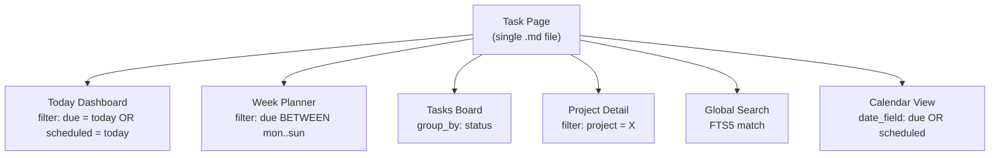
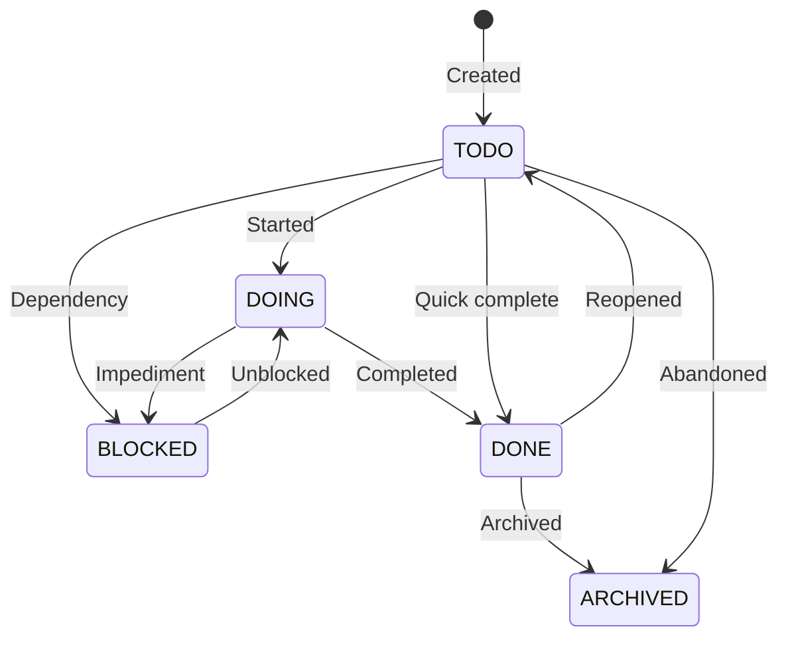
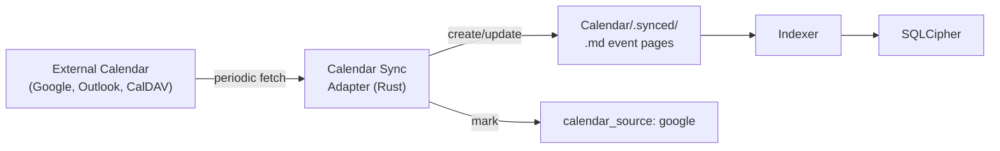
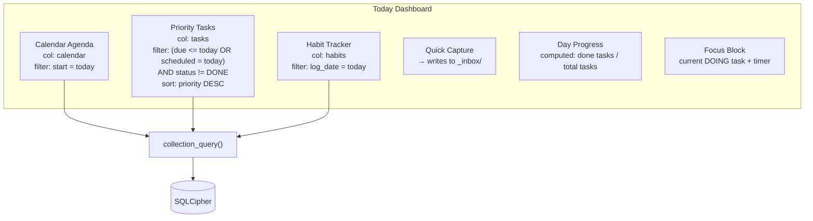
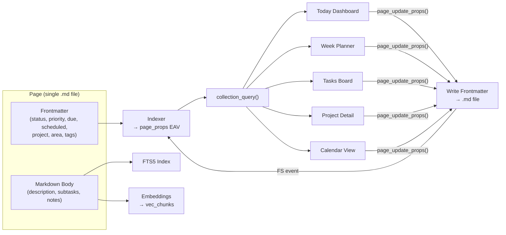

# Cortex Life OS — Tasks, Planning, Projects & Calendar

**Status:** Draft v1
 **Date:** 2026-02-18
 **Parent:** `001_architecture.md`
 **Scope:** Task lifecycle, project tracking, daily/weekly planning, calendar views, cross-view shared task model

------

## 0) Core Principle: Tasks Are Shared, Views Are Lenses

A task is a single Markdown page with `kind: task`. It appears in **every view that queries it** — the Today Dashboard, the Week Planner, the Project Detail, the Tasks Board, and the global search. There is no duplication. When a task's status changes in the Board view, it's immediately reflected in Today.

This is the power of the unified data model: one page, many views.



------

## 1) Task Schema

### 1.1 Frontmatter Definition

```yaml
---
id: pg_01JFC1...
kind: task
title: Implement DB Actor pattern
status: TODO              # TODO | DOING | BLOCKED | DONE | ARCHIVED
priority: HIGH            # HIGH | MEDIUM | LOW | NONE
due: 2026-02-25
scheduled: 2026-02-20    # when to work on it (distinct from due)
start_time: "09:00"      # optional: time block on scheduled day
duration_min: 90          # optional: estimated duration
project: /Projects/Cortex.md
area: engineering         # life area (work, health, home, personal, learning)
energy: high              # high | medium | low — for energy-aware scheduling
recurring: false
recurrence_rule: ""       # "daily" | "weekdays" | "weekly:mon,wed" | "monthly:15" | cron
assignee: ""              # for future multi-user; default empty (self)
blocked_by: []            # page_ids of blocking tasks
tags: [backend, architecture]
created: 2026-02-18T10:00:00Z
modified: 2026-02-18T10:00:00Z
completed_at: ""
---
# Implement DB Actor pattern

Set up the dedicated blocking thread with tokio::sync::mpsc channels.

## Subtasks
- [ ] Define DbRequest enum
- [ ] Implement actor loop with rusqlite connection
- [ ] Add oneshot response channels
- [ ] Benchmark concurrent reads

## Notes
Reference: https://docs.rs/rusqlite/latest/rusqlite/
See also: [[SQLite concurrency research]]
```

> **Phase 0 Divergence:** The frontend `Task` type uses a simpler field set. **Missing from frontend:** `scheduled`, `start_time`, `duration_min`, `area`, `energy`, `recurring`, `recurrence_rule`, `blocked_by`, `completed_at`. **Added in frontend (not in vision):** `taskType` (enum: Project, Task, Bug, Dev, Work), `comments` (embedded array), `boardColumnId`. The frontend also uses `TODO | DOING | DONE | ARCHIVED` (no `BLOCKED` status). See `000_OVERVIEW.md` §7 FE-AD-04, `005_TYPE_RECONCILIATION.md` §1. **Resolution:** See `ADR-0008` — BLOCKED is required and will be added in Phase 1.

### 1.2 Task Status Lifecycle



### 1.3 Task Collection Definition

```json
{
    "id": "col_tasks",
    "name": "Tasks",
    "icon": "check-square",
    "selector": { "kind": "task" },
    "schema": {
        "status": {
            "type": "select",
            "options": ["TODO", "DOING", "BLOCKED", "DONE", "ARCHIVED"],
            "default": "TODO"
        },
        "priority": {
            "type": "select",
            "options": ["HIGH", "MEDIUM", "LOW", "NONE"],
            "default": "NONE"
        },
        "due": { "type": "date" },
        "scheduled": { "type": "date" },
        "start_time": { "type": "text" },
        "duration_min": { "type": "number" },
        "project": { "type": "relation" },
        "area": {
            "type": "select",
            "options": ["work", "health", "home", "personal", "learning", "finance"]
        },
        "energy": {
            "type": "select",
            "options": ["high", "medium", "low"]
        },
        "recurring": { "type": "boolean", "default": false },
        "recurrence_rule": { "type": "text" },
        "blocked_by": { "type": "multi_select" },
        "completed_at": { "type": "datetime" }
    },
    "default_view": "view_tasks_board",
    "folder": "Tasks"
}
```

------

## 2) Project Schema

### 2.1 Frontmatter Definition

A project is a container that tasks and notes link to. It tracks high-level progress, milestones, and resources.

```yaml
---
id: pg_01JFD1...
kind: project
title: Cortex Life OS
status: ACTIVE           # NOT_STARTED | ACTIVE | ON_HOLD | COMPLETED | ARCHIVED
priority: HIGH
area: work
start: 2026-02-15
target_end: 2026-06-01
progress: 25             # computed or manually set (0–100)
milestones:
  - id: ms_01
    title: Spike Gate
    done: true
  - id: ms_02
    title: Vault + Indexing
    done: false
  - id: ms_03
    title: Collection Views
    done: false
resources:
  - label: "GitHub Repo"
    url: "https://github.com/jtarriela/cortex-os"
  - label: "Architecture Docs"
    url: "/docs/001_architecture.md"
tags: [project, engineering, cortex]
created: 2026-02-15T08:00:00Z
modified: 2026-02-18T14:30:00Z
---
# Cortex Life OS

Local-first Life OS. Markdown vault + encrypted DB + Notion-like views.

## Goals
- Ship MVP by April 2026
- Open source core, enterprise license for teams
- Demonstrate AI engineering skills for job applications

## Architecture Decisions
- [[001_architecture]]
- [[002_COLLECTIONS]]

## Research Notes
- [[Competitive analysis — Reor vs Obsidian vs Notion]]
- [[TipTap vs CodeMirror evaluation]]
```

### 2.2 Project Collection Definition

```json
{
    "id": "col_projects",
    "name": "Projects",
    "icon": "folder-kanban",
    "selector": { "kind": "project" },
    "schema": {
        "status": {
            "type": "select",
            "options": ["NOT_STARTED", "ACTIVE", "ON_HOLD", "COMPLETED", "ARCHIVED"],
            "default": "NOT_STARTED"
        },
        "priority": {
            "type": "select",
            "options": ["HIGH", "MEDIUM", "LOW"]
        },
        "area": {
            "type": "select",
            "options": ["work", "health", "home", "personal", "learning", "finance"]
        },
        "start": { "type": "date" },
        "target_end": { "type": "date" },
        "progress": { "type": "number" }
    },
    "default_view": "view_projects_gallery",
    "folder": "Projects"
}
```

### 2.3 Project ↔ Task Relationship

Tasks reference projects via `project: /Projects/Cortex.md`. The Project Detail view queries:

```
collection_query("col_tasks", filters: [
    { key: "project", op: "eq", value: "<project_page_id>" }
])
```

**Computed progress:** Optionally, project progress can be computed:

```
progress = (tasks with status DONE) / (total tasks linked to project) × 100
```

This is a computed field calculated at query time by the backend, not stored in frontmatter (to avoid constant file writes).

------

## 3) Calendar & Events

### 3.1 Event Schema

```yaml
---
id: pg_01JFE1...
kind: event
title: System Design Mock Interview
start: 2026-02-20T09:00
end: 2026-02-20T10:30
all_day: false
location: "40.7128,-74.0060"
location_name: "Blue Bottle Coffee, Williamsburg"
calendar_source: cortex     # cortex | google | outlook | caldav (for synced events)
linked_notes: [/Notes/system-design-prep.md]
linked_tasks: [/Tasks/review-system-design-patterns.md]
recurrence_rule: ""
reminder_min: 30            # minutes before
tags: [interview, career]
created: 2026-02-18T10:00:00Z
modified: 2026-02-18T10:00:00Z
---
# System Design Mock Interview

## Prep
- Review: distributed systems patterns
- Practice: design a chat system (WhatsApp scale)
- Bring: notebook, pen, laptop

## Follow-up
- [ ] Send thank-you note
- [ ] Review what went well / what to improve
```

### 3.2 Event Collection

```json
{
    "id": "col_calendar",
    "name": "Calendar",
    "icon": "calendar",
    "selector": { "kind": "event" },
    "schema": {
        "start": { "type": "datetime", "required": true },
        "end": { "type": "datetime" },
        "all_day": { "type": "boolean", "default": false },
        "location": { "type": "location" },
        "location_name": { "type": "text" },
        "calendar_source": {
            "type": "select",
            "options": ["cortex", "google", "outlook", "caldav"]
        },
        "linked_notes": { "type": "multi_select" },
        "linked_tasks": { "type": "multi_select" },
        "recurrence_rule": { "type": "text" },
        "reminder_min": { "type": "number" }
    },
    "default_view": "view_calendar_week",
    "folder": "Calendar"
}
```

### 3.3 Calendar Views

**Week View (default):**

- 7-column grid, hour rows (7am–10pm configurable)
- Events rendered as positioned blocks based on `start`/`end` times
- Tasks with `scheduled` date and `start_time` also appear (ghost style, distinguishable from events)
- Drag interactions: move event (updates start/end), resize event (updates end), drag task from sidebar onto calendar (sets scheduled + start_time)

**Month View:**

- Traditional month grid
- Day cells show event count + first 2–3 event titles
- Click day → opens day detail or zooms to week

**Day View:**

- Single-column timeline
- Detailed event blocks with linked notes preview
- Today Dashboard uses this layout for the agenda widget

**Agenda View:**

- Chronological list of upcoming events (no grid)
- Groups by day, shows next 7/14/30 days
- Good for the Today Dashboard sidebar widget

### 3.4 Calendar Sync (Phase 2+)

**Read-only CalDAV/ICS import:**



- Synced events are marked `calendar_source: google` (or equivalent) and stored in `Calendar/.synced/`
- Synced events are read-only in Cortex (edits must happen in the source calendar)
- Sync runs on a configurable interval (5min, 15min, manual)
- Conflict resolution: source calendar wins for synced events

**Two-way sync:** Deferred. Too complex for v1. Users create events in Cortex (internal) or in their external calendar (synced read-only).

------

## 4) Today Dashboard

The Today Dashboard is a **composite view** — it queries multiple collections and renders them as widgets on a single canvas.

### 4.1 Architecture



### 4.2 Widget Queries

**Calendar Agenda widget:**

```json
{
    "collection_id": "col_calendar",
    "filters": [
        { "key": "start", "op": "gte", "value": "2026-02-18T00:00:00" },
        { "key": "start", "op": "lt", "value": "2026-02-19T00:00:00" }
    ],
    "sorts": [{ "key": "start", "dir": "asc" }],
    "projection": ["title", "start", "end", "location_name", "linked_notes"]
}
```

**Priority Tasks widget:**

```json
{
    "collection_id": "col_tasks",
    "filters": [
        { "key": "status", "op": "in", "value": ["TODO", "DOING", "BLOCKED"] },
        {
            "_or": [
                { "key": "due", "op": "lte", "value": "2026-02-18" },
                { "key": "scheduled", "op": "eq", "value": "2026-02-18" }
            ]
        }
    ],
    "sorts": [
        { "key": "priority", "dir": "desc" },
        { "key": "due", "dir": "asc" }
    ],
    "projection": ["title", "status", "priority", "due", "project", "energy"]
}
```

### 4.3 Quick Capture

The Quick Capture widget writes to `_inbox/{date}.md`:

```markdown
---
id: pg_auto...
kind: inbox
captured_at: 2026-02-18T14:32:00Z
tags: [inbox]
---
# Quick Capture — Feb 18, 2026

- Call dentist about the crown
- Look into Japan rail pass pricing
- Read the distributed systems paper from the reading list
```

Inbox items are parsed by the AI (Phase 4, Morning Review) into structured tasks/events/notes. Until then, they're searchable plain text.

> **Phase 0 Divergence:** The Today Dashboard also includes a **schedule timeline** (FR-026) with time-blocked `ScheduleItem` entries (start time + duration) managed via `dataService.ts` (`getTodaySchedule`, `addToSchedule`). This is implemented as a separate `ScheduleItem` type, not through the Calendar event system described in Section 3. Tasks can be dragged onto the timeline to be scheduled. **Resolution:** See `ADR-0007` — ScheduleItem is converged into CalendarEvent. The Today timeline will query the calendar collection filtered to today.

### 4.4 End-of-Day Reflection

An optional end-of-day flow:

1. Show today's completed tasks
2. Show incomplete tasks — offer to reschedule to tomorrow or defer
3. Quick journal prompt: "How was your day?" → writes to `Notes/daily/{date}.md`
4. Reschedule action: updates `scheduled` date in task frontmatter

------

## 5) Week Planner

### 5.1 Layout

The Week Planner is a two-panel view:

```
┌──────────────────────────────────────────────────────┐
│  Week of Feb 17–23, 2026              [< prev] [next >]│
├────────────┬─────────────────────────────────────────┤
│            │  Mon    Tue    Wed    Thu    Fri    Sat  Sun │
│  SIDEBAR   │  ┌───┐  ┌───┐  ┌───┐  ┌───┐  ┌───┐       │
│            │  │evt│  │evt│  │   │  │evt│  │   │       │
│  Unscheduled│  │   │  │   │  │   │  │   │  │   │       │
│  Tasks     │  ├───┤  ├───┤  │   │  ├───┤  │   │       │
│  (backlog) │  │tsk│  │   │  │tsk│  │   │  │tsk│       │
│            │  │   │  │   │  │   │  │   │  │   │       │
│  ──────    │  └───┘  └───┘  └───┘  └───┘  └───┘       │
│  Projects  │                                           │
│  Focus     │  ─────────────────────────────────────── │
│            │  Week Goals:                              │
│            │  [ ] Ship Spike Gate                      │
│            │  [ ] Finish architecture docs             │
├────────────┴─────────────────────────────────────────┤
│  Review Prompts (expandable):                          │
│  • What went well this week?                           │
│  • What needs to carry over?                           │
│  • Energy levels — when were you most productive?      │
└──────────────────────────────────────────────────────┘
```

### 5.2 Interactions

**Drag task from sidebar → day column:** Sets `scheduled` date on the task. If dropped on a time slot, also sets `start_time`.

**Drag event between days:** Updates `start`/`end` dates (preserving time of day).

**Click task → Context Drawer:** Opens task inspector with full detail + linked notes.

**Week Goals:** A special page `Notes/weekly/{year}-W{week}.md` with `kind: weekly_review`. Created automatically on first access to a new week.

### 5.3 Week Query

The week view makes two collection queries:

```
// Events for the week
collection_query("col_calendar", filters: [
    { key: "start", op: "gte", value: "2026-02-17T00:00:00" },
    { key: "start", op: "lt", value: "2026-02-24T00:00:00" }
])

// Tasks scheduled or due this week
collection_query("col_tasks", filters: [
    { key: "status", op: "in", value: ["TODO", "DOING", "BLOCKED"] },
    { _or: [
        { key: "scheduled", op: "gte", value: "2026-02-17" },
        { key: "due", op: "lte", value: "2026-02-23" }
    ]}
])

// Unscheduled backlog (sidebar)
collection_query("col_tasks", filters: [
    { key: "status", op: "in", value: ["TODO"] },
    { key: "scheduled", op: "is_empty" }
], sorts: [{ key: "priority", dir: "desc" }])
```

------

## 6) Project Detail View

### 6.1 Layout

```
┌──────────────────────────────────────────────────────┐
│  Project: Cortex Life OS                    [ACTIVE]  │
├────────────┬─────────────────────────────────────────┤
│            │  OVERVIEW                                │
│  Sidebar   │  ┌─────────────────────────────────┐    │
│            │  │ Progress: ████████░░░░░ 45%     │    │
│  Milestones│  │ Target: Jun 1, 2026             │    │
│  ☑ Spike   │  │ Tasks: 12 open / 8 done         │    │
│  ☐ Vault   │  └─────────────────────────────────┘    │
│  ☐ Views   │                                         │
│  ☐ Search  │  TASK BOARD (embedded collection view)  │
│  ☐ AI      │  ┌──────┬──────┬──────┬──────┐         │
│            │  │ TODO │ DOING│BLOCKED│ DONE │         │
│  ──────    │  │ task │ task │ task │ task │         │
│  Resources │  │ task │      │      │ task │         │
│  • GitHub  │  │ task │      │      │ task │         │
│  • Docs    │  └──────┴──────┴──────┴──────┘         │
│            │                                         │
│  ──────    │  LINKED NOTES                           │
│  Tags      │  • Architecture v1                      │
│  #cortex   │  • Collections spec                     │
│  #eng      │  • Competitive analysis                 │
└────────────┴─────────────────────────────────────────┘
```

### 6.2 Embedded Collection View

The task board inside Project Detail is the same `collection_query()` with an additional project filter:

```json
{
    "collection_id": "col_tasks",
    "view_id": "view_tasks_board",
    "filters": [
        { "key": "project", "op": "eq", "value": "pg_01JFD1..." }
    ]
}
```

This means the board view component is **reused** — it doesn't know or care that it's inside a project page vs. the standalone Tasks Board. The filter is the only difference.

### 6.3 Milestone Tracking

Milestones are stored in the project's YAML frontmatter as an array. Toggling a milestone checkbox:

1. Frontend calls `page_update_props(project_id, { milestones: [...updated] })`
2. Backend updates the frontmatter YAML and writes the `.md` file
3. FS watcher detects change → re-index → emit event
4. Project Detail view refreshes

Milestones are **not** separate pages (they're too lightweight). If a milestone needs detail, link it to a task or note.

------

## 7) Recurring Tasks

### 7.1 Recurrence Model

When a recurring task is completed:

1. The current instance is marked `DONE` with `completed_at` timestamp
2. A new instance is created with the next scheduled date per `recurrence_rule`
3. The new instance has a fresh `id` but carries over: title, priority, project, area, tags, energy, duration

**Recurrence rules (v1 — simple):**

- `daily` — every day
- `weekdays` — Mon–Fri
- `weekly:mon,wed,fri` — specific days
- `monthly:15` — 15th of each month
- `biweekly` — every 2 weeks

**Recurrence rules (later):** Full iCal RRULE support.

### 7.2 Implementation

The recurrence engine runs in the backend when a task is completed:

```
on_task_completed(task):
    if task.recurring && task.recurrence_rule:
        next_date = compute_next_date(task.scheduled, task.recurrence_rule)
        new_task = clone_task(task, {
            id: new_uuid(),
            status: "TODO",
            scheduled: next_date,
            completed_at: null
        })
        vault_create_page(new_task)
```

This creates a real `.md` file — no phantom/virtual tasks. The completed instance persists as history.

------

## 8) Task Dependencies (`blocked_by`)

When a task has `blocked_by: [pg_task_a, pg_task_b]`, the UI shows:

- A "Blocked" badge on the task card
- The blocking tasks in the Context Drawer
- A warning if the user tries to start the task before blockers are done

When all blocking tasks reach `DONE`, the blocked task auto-transitions from `BLOCKED` → `TODO` (emits event for UI notification).

This is implemented via a post-completion hook in the backend:

```
on_task_completed(task):
    // Check if this unblocks other tasks
    blocked_tasks = query("SELECT page_id FROM page_props WHERE key = 'blocked_by' AND value_text = ?", task.page_id)
    for blocked in blocked_tasks:
        remaining_blockers = query("SELECT ... WHERE blocked_by NOT IN (done tasks)")
        if remaining_blockers.is_empty():
            update_task_status(blocked, "TODO")
```

------

## 9) Energy-Aware Scheduling (AI-Enhanced, Phase 4)

Tasks have an `energy` property (`high`, `medium`, `low`). Combined with time-of-day patterns, the AI can suggest optimal scheduling:

- High-energy tasks → morning slots
- Low-energy tasks → afternoon
- Meeting-heavy days → lighter task load

This feeds into the Morning Review / AI Planning assistant. For v1, it's just a filterable property. The AI scheduling is Phase 4.

------

## 10) Focus Mode

The Today Dashboard includes a **Focus Block** — a prominent widget showing the current `DOING` task with:

- Task title + description
- Timer (Pomodoro-style, optional)
- Quick actions: Complete, Pause (→ TODO), Block (→ BLOCKED), Add Note
- Linked resources (project, notes)

Only one task can be `DOING` at a time. Starting a new task auto-pauses the current one.

------

## 11) Task Quick-Create Flows

Tasks can be created from multiple entry points, all flowing through the same `vault_create_page()`:

| Entry Point                                    | Pre-filled Fields                                         |
| ---------------------------------------------- | --------------------------------------------------------- |
| Command Palette (`/task`)                      | Empty                                                     |
| Today Dashboard "+" button                     | `scheduled: today`                                        |
| Week Planner drag-to-day                       | `scheduled: <dropped day>`                                |
| Project Detail "+" button                      | `project: <current project>`                              |
| Note context menu "Create task from selection" | `title: <selected text>`, linked to source note           |
| Calendar right-click "Add task"                | `scheduled: <clicked date>`, `start_time: <clicked time>` |
| Quick Capture (inbox)                          | Goes to inbox; AI parses later                            |

------

## 12) Cross-View Data Flow Summary



Every view reads from the same index. Every write goes through the same pipeline. No view has private state about tasks. This is what makes the system coherent.