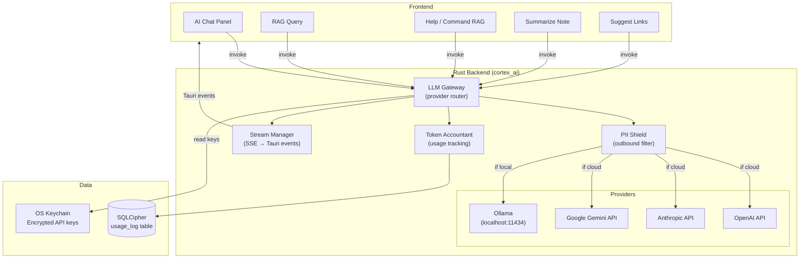
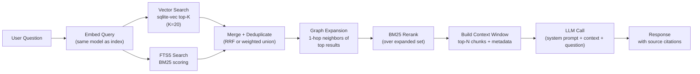
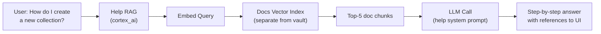
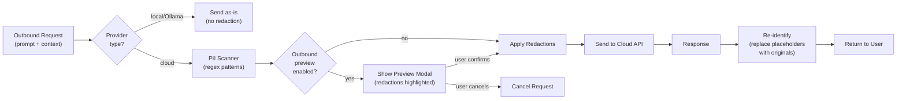
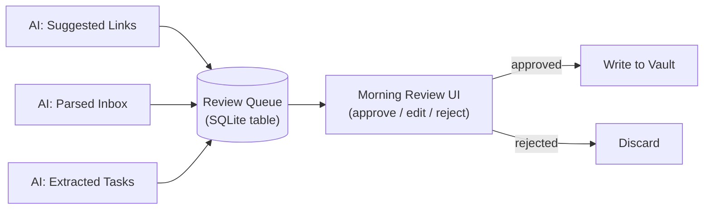
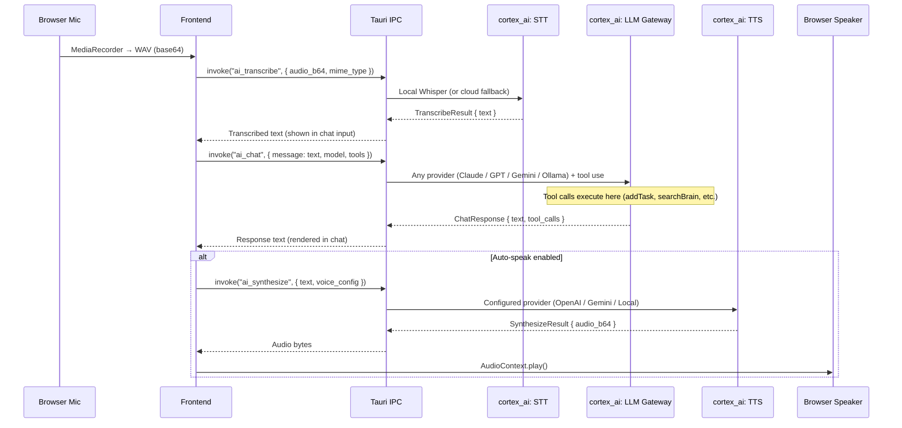

# Cortex Life OS — AI Integration Architecture

**Status:** Draft v1
 **Date:** 2026-02-18
 **Parent:** `001_architecture.md`
 **Scope:** LLM gateway, multi-provider support, secure key storage, RAG pipeline, PII shield, command/help RAG, agentic roadmap

------

## 0) AI Philosophy

Cortex's AI layer follows three principles:

1. **Backend-only execution.** All LLM calls happen in Rust. No API keys, no raw prompts, and no user content transits the frontend for cloud-bound requests.

> **Phase 0 Divergence (SIGNIFICANT):** The frontend makes direct Gemini API calls from the browser via `@google/genai` SDK (`aiService.ts`). API keys are stored in React state and `localStorage`. This violates the "backend-only execution" principle but was a deliberate Phase 0 acceleration decision. See FE-AD-03, ADR-0004.

2. **Human-in-the-loop.** The AI proposes (suggested links, parsed inbox, extracted tasks). The user approves. No autonomous vault writes.

> **Phase 0 Divergence (SIGNIFICANT):** The AI agent has 4 function declarations (`addTask`, `addGoal`, `addJournalEntry`, `searchBrain`) that execute CRUD immediately when the LLM calls them. There is no approval queue, no Morning Review, and no undo. This is the most architecturally significant divergence from the original vision. See ADR-0005.
3. **Provider-agnostic.** The user picks their provider and model. Cortex doesn't lock you into one vendor. Local inference (Ollama) is a first-class option.

------

## 1) LLM Gateway Architecture

### 1.1 Overview



### 1.2 Provider Trait (Rust)

```rust
#[async_trait]
pub trait LlmProvider: Send + Sync {
    fn provider_id(&self) -> &str;           // "ollama", "openai", "anthropic", "google"
    fn display_name(&self) -> &str;
    fn available_models(&self) -> Vec<ModelInfo>;

    async fn chat(
        &self,
        request: ChatRequest,
        tx: mpsc::Sender<StreamChunk>,       // streaming chunks
    ) -> Result<ChatResponse>;

    async fn embed(
        &self,
        texts: Vec<String>,
    ) -> Result<Vec<Vec<f32>>>;              // embedding vectors

    async fn transcribe(
        &self,
        audio: AudioInput,
        language: Option<String>,
    ) -> Result<TranscribeResponse>;

    async fn synthesize(
        &self,
        text: String,
        voice_config: VoiceConfig,
    ) -> Result<AudioOutput>;

    fn supports_streaming(&self) -> bool;
    fn supports_embeddings(&self) -> bool;
    fn supports_tool_use(&self) -> bool;
    fn supports_transcription(&self) -> bool;
    fn supports_synthesis(&self) -> bool;
}

// Voice I/O types (see ADR-0013)

pub struct AudioInput {
    pub data: Vec<u8>,              // raw audio bytes
    pub mime_type: String,          // "audio/wav", "audio/pcm"
    pub sample_rate: u32,
    pub language_hint: Option<String>,
}

pub struct TranscribeResponse {
    pub text: String,
    pub detected_language: Option<String>,
    pub duration_ms: u64,
}

pub struct VoiceConfig {
    pub provider: String,           // "openai", "gemini", "local"
    pub voice_id: String,           // provider-specific voice name or ID
    pub speed: Option<f32>,         // 0.5–2.0 if supported
    pub instructions: Option<String>, // OpenAI instructable TTS only
}

pub struct AudioOutput {
    pub data: Vec<u8>,              // PCM or MP3 bytes
    pub mime_type: String,
    pub sample_rate: u32,
    pub duration_ms: u64,
}
```

### 1.3 Request/Response Types

```rust
pub struct ChatRequest {
    pub model: String,                       // e.g., "gpt-4o", "claude-sonnet-4-6-20250514", "gemini-2.0-flash"
                                             // Note: Model IDs are managed by the backend provider config
                                             // and frontend AVAILABLE_MODELS registry. IDs shown here are
                                             // illustrative — check provider docs for current values.
    pub messages: Vec<Message>,
    pub system_prompt: Option<String>,
    pub temperature: f32,
    pub max_tokens: u32,
    pub tools: Option<Vec<ToolDef>>,         // for tool-use capable models
    pub context: Option<RAGContext>,          // injected retrieval context
}

pub struct ChatResponse {
    pub text: String,
    pub usage: TokenUsage,
    pub model: String,
    pub provider: String,
    pub tool_calls: Option<Vec<ToolCall>>,
    pub finish_reason: String,
}

pub struct TokenUsage {
    pub input_tokens: u64,
    pub output_tokens: u64,
    pub source: UsageSource,                 // Reported (from API) or Estimated (tiktoken approx)
}

pub struct StreamChunk {
    pub request_id: String,
    pub delta: String,                       // incremental text
    pub done: bool,
    pub usage: Option<TokenUsage>,           // populated on final chunk
}
```

------

## 2) Provider Configuration

### 2.1 Supported Providers (v1)

| Provider          | Auth             | Embedding                      | Streaming | Tool Use | STT | TTS | Notes                                   |
| ----------------- | ---------------- | ------------------------------ | --------- | -------- | --- | --- | --------------------------------------- |
| **Ollama**        | None (localhost) | Yes (nomic-embed-text, etc.)   | Yes (SSE) | Limited  | No  | No  | Default for privacy. No API key needed. |
| **OpenAI**        | API key (BYOK)   | Yes (text-embedding-3-small)   | Yes (SSE) | Yes      | Yes — `gpt-4o-mini-transcribe` | Yes — `gpt-4o-mini-tts` (13+ voices) | Most mature tool-use and voice support |
| **Anthropic**     | API key (BYOK)   | No (use Ollama for embeddings) | Yes (SSE) | Yes      | No  | No  | No voice API. Use chained approach with separate STT/TTS. |
| **Google Gemini** | API key (BYOK)   | Yes (text-embedding-004)       | Yes       | Yes      | Partial — multimodal `generateContent` | Yes — `gemini-2.5-flash-preview-tts` (5 voices) | Also supports Live Audio (native speech-to-speech) |
| **Local Whisper** | None (bundled)   | No                             | No        | No       | Yes — whisper-rs/whisper.cpp (offline, GGML) | No | Default STT. Runs on-device. See ADR-0013. |
| **Local TTS**     | None (bundled)   | No                             | No        | No       | No  | Future — Piper (ONNX, offline) | Phase 5+. Not yet implemented. |

> **Note:** Local Whisper and Local TTS are not `LlmProvider` implementations — they are dedicated voice subsystems listed here for completeness. See ADR-0013.

### 2.2 Model Selection UI

Settings → AI shows:

```
┌─────────────────────────────────────────────────┐
│  AI Providers                                    │
├─────────────────────────────────────────────────┤
│  ☑ Ollama (Local)          [Connected ✓]        │
│    Models: llama3.1, mistral, nomic-embed-text   │
│    Endpoint: localhost:11434                      │
│                                                  │
│  ☑ OpenAI                  [Key saved ✓]        │
│    Models: gpt-4o, gpt-4o-mini                   │
│    Key: ••••••••••sk-abc  [Update] [Remove]     │
│                                                  │
│  ☑ Anthropic               [Key saved ✓]        │
│    Models: claude-sonnet-4-6-*, claude-haiku-4-5  │
│    Key: ••••••••••sk-ant  [Update] [Remove]     │
│                                                  │
│  ☐ Google Gemini           [No key]             │
│    [Add API Key]                                 │
├─────────────────────────────────────────────────┤
│  Default Models                                  │
│  Chat: [gpt-4o          ▾]                      │
│  Embeddings: [nomic-embed-text (Ollama) ▾]      │
│  Quick tasks: [gpt-4o-mini  ▾]                  │
├─────────────────────────────────────────────────┤
│  Voice                                             │
│  STT Provider: [Local Whisper (offline)  ▾]       │
│  TTS Provider: [Gemini TTS              ▾]        │
│  Voice:        [Kore                    ▾]        │
│  Auto-speak:   [ON]                               │
├─────────────────────────────────────────────────┤
│  Usage This Month                                │
│  OpenAI:    12,450 tokens  ~$0.04               │
│  Anthropic: 8,200 tokens   ~$0.02               │
│  Ollama:    45,000 tokens  (free/local)         │
│  [View detailed usage →]                         │
└─────────────────────────────────────────────────┘
```

### 2.3 Ollama Auto-Detection

On app launch, the backend pings `http://localhost:11434/api/tags` to detect running Ollama instance. If found, auto-populate available models. If not found, show "Ollama not detected — install from ollama.ai" with link.

```rust
async fn detect_ollama() -> Option<Vec<ModelInfo>> {
    let resp = reqwest::get("http://localhost:11434/api/tags").await.ok()?;
    let body: OllamaTagsResponse = resp.json().await.ok()?;
    Some(body.models.into_iter().map(|m| ModelInfo {
        id: m.name.clone(),
        display_name: m.name,
        provider: "ollama".into(),
        capabilities: infer_capabilities(&m),
    }).collect())
}
```

------

## 3) Secure Key Storage

### 3.1 Architecture

```mermaid
flowchart LR
    UI["Settings UI\n(key input)"] -->|invoke| CMD["Tauri Command\nai_set_provider_key()"]
    CMD --> CRYPTO["cortex_crypto\nencrypt(key, db_master_key)"]
    CRYPTO --> DB[("app_config table\nencrypted_key blob")]

    LLM["LLM Gateway\n(needs key)"] --> CRYPTO2["cortex_crypto\ndecrypt(blob, db_master_key)"]
    CRYPTO2 --> DB
    CRYPTO2 -->|plaintext key\n(in-memory only)| LLM
```

### 3.2 Key Lifecycle

1. **User enters key** in Settings UI (frontend)
2. Frontend calls `invoke("ai_set_provider_key", { provider: "openai", key: "sk-..." })`
3. Backend encrypts key with the SQLCipher database master key (AES-256-GCM via `ring`)
4. Encrypted blob stored in `app_config` table: `key = "api_key:openai"`, `value = <encrypted>`
5. **Key never stored in plaintext on disk.** Never in localStorage. Never in `.env` files.
6. When the LLM gateway needs the key, it decrypts from DB into memory, uses it for the API call, then the in-memory reference is dropped

### 3.3 Key Validation

Before saving, the backend validates the key by making a minimal API call:

```rust
async fn validate_key(provider: &str, key: &str) -> Result<bool> {
    match provider {
        "openai" => {
            // GET /v1/models with the key
            let resp = client.get("https://api.openai.com/v1/models")
                .header("Authorization", format!("Bearer {}", key))
                .send().await?;
            Ok(resp.status().is_success())
        }
        "anthropic" => {
            // POST /v1/messages with minimal payload
            // ...
        }
        "google" => {
            // GET /v1beta/models with key param
            // ...
        }
        _ => Ok(false)
    }
}
```

### 3.4 DB Master Key Storage

The SQLCipher database master key itself is stored in the **OS Keychain**:

| OS      | Keychain API              | Crate                 |
| ------- | ------------------------- | --------------------- |
| macOS   | Keychain Services         | `security-framework`  |
| Linux   | libsecret / GNOME Keyring | `secret-service`      |
| Windows | Windows Credential Vault  | `windows-credentials` |

On first launch, the user sets a vault password → Argon2id derives the DB key → the derived key is stored in OS keychain for session persistence. On subsequent launches, the key is retrieved from keychain (or user re-enters password if keychain is locked).

------

## 4) RAG Pipeline (Retrieval-Augmented Generation)

### 4.1 Pipeline Overview



### 4.2 Retrieval Strategy: Hybrid Vector + FTS + Graph

**Step 1 — Dual retrieval:**

- **Vector search:** Embed the query with the same model used for indexing (e.g., `nomic-embed-text` via Ollama). Query `vec_chunks` for top-20 by cosine similarity.
- **FTS5 search:** Run the query against `pages_fts` for BM25-ranked results. Return top-20 chunks.

**Step 2 — Merge (Reciprocal Rank Fusion):**

```
score(chunk) = Σ 1 / (k + rank_in_source)
```

Where `k = 60` (standard RRF constant). This combines semantic similarity (vector) with keyword relevance (BM25) without needing comparable score scales.

**Step 3 — Graph expansion:** For the top-10 merged results, fetch 1-hop neighbors from `graph_edges` (wikilinks, relations, AI-suggested links). Add their chunks to the candidate pool. This captures contextually related notes that neither vector nor keyword search would find alone.

**Step 4 — Final rerank:** BM25 rerank the expanded candidate set against the original query. Take top-N chunks (N = 5–10, configurable, bounded by context window budget).

**Step 5 — Context assembly:**

```
System: You are a knowledge assistant for a personal vault of notes.
Answer the user's question using ONLY the provided context.
Cite sources by note title. If the context doesn't contain
the answer, say so.

Context:
---
[Note: "Distributed Systems Patterns" | Section: "Event Sourcing"]
Event sourcing stores state changes as an append-only log...
---
[Note: "Cortex Architecture v1" | Section: "DB Actor Pattern"]
All database access flows through a single DB Actor thread...
---

User: How does the DB Actor pattern relate to event sourcing?
```

### 4.3 Embedding Pipeline

**Indexing (background):**

1. On note index/re-index, chunk the body (heading-aware, ~2000 char target, ~3000 char hard max)
2. Batch chunks (32 at a time) → send to embedding provider
3. Store vectors in `vec_chunks`, metadata in `chunks`
4. Hash-based incremental: only re-embed chunks whose `content_hash` changed

**Query (real-time):**

1. Embed the user's question (single vector)
2. Query `vec_chunks` for cosine similarity top-K

**Default embedding model:** `nomic-embed-text` via Ollama (384 dimensions, runs locally). Users can switch to OpenAI `text-embedding-3-small` (1536 dim) or Google `text-embedding-004` if they prefer cloud embeddings.

Changing the embedding model triggers a full re-embed (background job with progress indicator).

### 4.4 Chunking Strategy

```rust
fn chunk_note(body: &str, max_chars: usize, hard_max: usize) -> Vec<Chunk> {
    // 1. Split by headings (H1-H6)
    // 2. If a heading section > max_chars, split by paragraphs
    // 3. If a paragraph > hard_max, split by sentences
    // 4. Each chunk carries: heading_path, char_start, char_end, content_hash
    // 5. Never split mid-sentence if avoidable
}
```

### 4.5 SQLite Schema for RAG

```sql
-- Already defined in 001_architecture.md:
-- vec_chunks (sqlite-vec virtual table)
-- chunks (metadata: page_id, heading_path, content_hash, content_text)
-- graph_edges (for graph expansion step)
-- pages_fts (FTS5 for BM25)

-- Token usage log
CREATE TABLE usage_log (
    id              TEXT PRIMARY KEY,
    timestamp       TEXT NOT NULL,
    provider        TEXT NOT NULL,       -- "ollama", "openai", "anthropic", "google"
    model           TEXT NOT NULL,
    feature         TEXT NOT NULL,       -- "chat", "rag", "summarize", "embed", "suggest_links", "help"
    input_tokens    INTEGER NOT NULL,
    output_tokens   INTEGER NOT NULL,
    usage_source    TEXT NOT NULL,       -- "reported" or "estimated"
    latency_ms      INTEGER,
    estimated_cost  REAL                 -- USD, computed from known pricing
);
```

------

## 5) AI Features

### 5.1 Chat (Inspector Panel)

The right drawer includes an AI Chat panel. The user selects a model from a dropdown and chats. Context can be injected:

- **No context:** General chat (model's training data only)
- **Current note:** The focused note's content is included as context
- **RAG:** The question triggers the full RAG pipeline; retrieved chunks are injected as context
- **Selection:** User highlights text in the editor → "Ask AI about this"

The chat history is ephemeral (not persisted across sessions) unless the user explicitly saves a conversation as a note.

### 5.2 Summarize Note

`invoke("ai_summarize", { page_id })` → Backend reads the note, sends to LLM with a summarization prompt, returns a structured summary:

```json
{
    "summary": "This note covers the DB Actor pattern for SQLite concurrency...",
    "key_points": ["Dedicated blocking thread", "mpsc channels", "No async DB calls"],
    "suggested_tags": ["architecture", "sqlite", "concurrency"],
    "suggested_links": ["pg_01JFX...", "pg_01JFY..."]
}
```

The user reviews and accepts/edits before anything is written.

### 5.3 Suggest Links

`invoke("ai_suggest_links", { page_id })` → Backend:

1. Embed the note's chunks
2. Find top-20 similar chunks across the vault (excluding self)
3. For top candidates, ask LLM: "Are these notes meaningfully related? If so, write a 1-sentence explanation."
4. Return suggested links with confidence scores and explanations

These appear in the **Morning Review** queue (Phase 4) or in the Context Drawer as "Suggested connections."

### 5.4 Inbox Auto-Parser (Phase 4)

Files in `_inbox/` are processed by the AI:

1. LLM receives raw text + prompt: "Structure this into: tasks (with due dates if mentioned), events (with dates/times), and notes (with appropriate tags)"
2. Parsed output appears in Morning Review for approval
3. On approval: structured pages are created in the appropriate vault folders

### 5.6 Voice I/O (Phase 0 — Frontend-Direct)

> **Not in original vision.** Added during Phase 0 frontend prototyping. Target architecture defined in **Section 12** and **ADR-0013**.

The frontend implements voice interaction via direct Gemini API calls:

- **Speech-to-text:** `transcribeAudio()` sends base64 WAV audio to Gemini for transcription
- **Text-to-speech:** `generateSpeech()` sends text to Gemini TTS API, returns base64 audio
- **Voice selection:** 5 voices (Puck, Charon, Kore, Fenrir, Zephyr) configurable in Settings
- **Auto-speak toggle:** When enabled, AI responses are automatically spoken aloud
- **Audio capture:** Browser MediaRecorder API for microphone input
- **Live session:** Stub only (placeholder for Gemini Live API)

**Phase 4 target:** Local Whisper STT (bundled, offline) + configurable TTS provider + chained voice chat through any LLM. See Section 12 for full architecture, ADR-0013 for decision rationale, FR-024.

### 5.7 Image Generation (Phase 0 — Frontend-Direct)

> **Not in original vision.** Added during Phase 0 frontend prototyping.

The frontend generates images for project artifacts via `generateImageArtifact()`:

- Uses Gemini image generation model
- Prompt constructed from project title, description, and milestones
- Generated image stored as base64 data URL on `Project.artifacts[]`
- Accessible from Project Detail view

See ADR-0004, FR-014.

### 5.8 Task Extraction (Phase 4)

On note save, scan for implicit action items:

- Pattern matching: "TODO:", "- [ ]", "I need to...", "Don't forget to..."
- LLM extraction: "Extract any action items from this text as structured tasks"
- Results appear in Morning Review, not auto-created

------

## 6) Command / Help RAG

### 6.1 Purpose

Cortex ships with a **built-in documentation corpus** that the AI can search to answer "how do I do X in Cortex?" questions. This is distinct from the vault RAG — it searches the app's own docs, not the user's notes.

### 6.2 Architecture



### 6.3 Documentation Corpus

The docs corpus lives in the app bundle (read-only), not in the user's vault:

```
resources/
  docs/
    getting-started.md
    collections.md
    views.md
    tasks-and-planning.md
    calendar.md
    ai-features.md
    keyboard-shortcuts.md
    editor-extensions.md
    troubleshooting.md
    faq.md
```

These are indexed at first launch into a **separate** vector table (not mixed with the user's vault embeddings):

```sql
CREATE VIRTUAL TABLE docs_vec USING vec0(
    chunk_id TEXT PRIMARY KEY,
    embedding float[384]
);

CREATE TABLE docs_chunks (
    chunk_id    TEXT PRIMARY KEY,
    doc_path    TEXT NOT NULL,
    heading     TEXT,
    content     TEXT
);
```

### 6.4 Help System Prompt

```
You are the Cortex Life OS help assistant. Answer the user's question
about how to use Cortex based ONLY on the provided documentation.

Be specific: mention exact UI elements, menu paths, keyboard shortcuts,
and settings locations. If the feature doesn't exist yet, say so.

Guide the user step-by-step. Use numbered steps for multi-step processes.

Documentation context:
---
{retrieved doc chunks}
---

User question: {question}
```

### 6.5 Access Points

- **Command Palette:** Type `?` or `help:` prefix → routes to Help RAG instead of vault search
- **AI Chat Panel:** Toggle between "Vault" mode (RAG over notes) and "Help" mode (RAG over docs)
- **Onboarding:** First-launch wizard suggests trying "Ask me how to create your first note"

### 6.6 Future: Agentic Help

Phase 5+ — the help system could become agentic:

1. User asks: "Create a Travel collection with fields for destination, dates, and budget"
2. Help RAG understands the intent
3. Instead of just explaining how, it **generates the collection JSON** and offers to create it
4. User approves → collection is created

This is the simplest form of "agentic" behavior because:

- The output is a well-defined JSON structure (not arbitrary code)
- It's validated against the collection schema before creation
- It still goes through HITL approval
- It operates on `.cortex/` config files, not user vault content

**Not MCP.** The agentic layer doesn't need Model Context Protocol because:

- All tools are internal Tauri commands (not external services)
- The tool surface is small and well-typed
- We control both the LLM prompt and the execution environment

If external integrations are added later (Google Calendar API, YNAB, etc.), MCP could make sense as a plugin protocol. But for v1, direct tool-calling via the LLM's native function-calling API is simpler and sufficient.

------

## 7) PII Shield

### 7.1 Flow



### 7.2 Pattern Registry (v1)

| Pattern      | Regex (simplified)                       | Placeholder  |
| ------------ | ---------------------------------------- | ------------ |
| Email        | `[\w.+-]+@[\w-]+\.[\w.]+`                | `[EMAIL_1]`  |
| Phone (US)   | `\(?\d{3}\)?[-.\s]?\d{3}[-.\s]?\d{4}`    | `[PHONE_1]`  |
| SSN          | `\d{3}-\d{2}-\d{4}`                      | `[SSN_1]`    |
| Credit card  | `\d{4}[-\s]?\d{4}[-\s]?\d{4}[-\s]?\d{4}` | `[CC_1]`     |
| IP address   | `\d{1,3}\.\d{1,3}\.\d{1,3}\.\d{1,3}`     | `[IP_1]`     |
| API key-like | `(sk-[a-zA-Z0-9]{20,}|AKIA[A-Z0-9]{16})` | `[APIKEY_1]` |

### 7.3 Configuration

Settings → Privacy → PII Shield:

| Setting          | Options                 | Default    |
| ---------------- | ----------------------- | ---------- |
| PII Shield level | Strict / Moderate / Off | Moderate   |
| Outbound preview | On / Off                | Off        |
| Apply to         | Cloud only / All / Off  | Cloud only |

`Moderate` redacts: SSN, credit card, API keys.
 `Strict` redacts: all patterns including email, phone, IP.

------

## 8) Token Accounting & Usage Dashboard

### 8.1 Tracking

Every LLM call logs to `usage_log`:

```rust
pub fn log_usage(entry: UsageEntry) {
    db_actor.send(DbRequest::Insert {
        table: "usage_log",
        data: entry,
    });
}
```

### 8.2 Cost Estimation

Known pricing (updated periodically in app config):

```json
{
    "openai": {
        "gpt-4o": { "input_per_1k": 0.0025, "output_per_1k": 0.01 },
        "gpt-4o-mini": { "input_per_1k": 0.00015, "output_per_1k": 0.0006 },
        "text-embedding-3-small": { "input_per_1k": 0.00002 }
    },
    "anthropic": {
        // Model IDs are illustrative — actual IDs managed by provider config
        "claude-sonnet-4-6-latest": { "input_per_1k": 0.003, "output_per_1k": 0.015 }
    },
    "google": {
        "gemini-2.0-flash": { "input_per_1k": 0.0001, "output_per_1k": 0.0004 }
    },
    "ollama": {}
}
```

### 8.3 Usage Dashboard (Settings → AI → Usage)

- Total tokens by provider (bar chart, monthly)
- Estimated cost by provider
- Breakdown by feature (chat, rag, summarize, embed, suggest)
- Reported vs. estimated tokens clearly labeled
- Export as CSV for expense tracking

### 8.4 Budget Guardrails (Optional)

Users can set monthly token budgets per provider:

- Soft limit: warning notification at 80%
- Hard limit: block cloud calls at 100% (local Ollama still works)

------

## 9) Morning Review (Phase 4 — HITL Approval Queue)

### 9.1 Concept

Every AI-proposed write action queues into Morning Review instead of executing immediately:



### 9.2 Review Item Schema

```sql
CREATE TABLE review_queue (
    item_id     TEXT PRIMARY KEY,
    item_type   TEXT NOT NULL,       -- "link_suggestion", "parsed_inbox", "extracted_task"
    source_id   TEXT,                -- page that triggered this
    proposed_json TEXT NOT NULL,      -- the proposed change (structured)
    explanation TEXT,                -- AI's reasoning
    confidence  REAL,               -- 0.0–1.0
    status      TEXT DEFAULT 'pending',  -- pending, approved, rejected
    created_at  TEXT,
    reviewed_at TEXT
);
```

### 9.3 UI

The Morning Review is accessible from:

- Today Dashboard widget: "3 items to review"
- Left nav badge indicator
- Command palette: `/review`

Each item shows: what the AI proposes, why, confidence level, and approve/edit/reject buttons.

------

## 10) Streaming Architecture

### 10.1 Flow

LLM responses stream token-by-token. The Rust backend reads the SSE/streaming response and forwards chunks as Tauri events:

```rust
async fn handle_chat_stream(
    request: ChatRequest,
    provider: &dyn LlmProvider,
    app_handle: AppHandle,
) {
    let request_id = uuid::Uuid::new_v4().to_string();
    let (tx, mut rx) = mpsc::channel(64);

    // Spawn the provider stream
    tokio::spawn(async move {
        provider.chat(request, tx).await.unwrap();
    });

    // Forward chunks as Tauri events
    while let Some(chunk) = rx.recv().await {
        app_handle.emit("ai_stream_chunk", &StreamEvent {
            request_id: request_id.clone(),
            text: chunk.delta,
            done: chunk.done,
            usage: chunk.usage,
        }).unwrap();
    }
}
```

### 10.2 Frontend Consumption

```typescript
// services/ai.ts
export function streamChat(params: ChatParams): {
    onChunk: (cb: (text: string) => void) => void;
    onDone: (cb: (usage: TokenUsage) => void) => void;
    cancel: () => void;
} {
    const requestId = invoke<string>("ai_chat_stream", params);

    listen<StreamEvent>("ai_stream_chunk", (event) => {
        if (event.payload.request_id === requestId) {
            if (event.payload.done) {
                onDoneCallback(event.payload.usage);
            } else {
                onChunkCallback(event.payload.text);
            }
        }
    });

    return {
        onChunk: (cb) => { onChunkCallback = cb; },
        onDone: (cb) => { onDoneCallback = cb; },
        cancel: () => invoke("ai_cancel_stream", { request_id: requestId }),
    };
}
```

------

## 11) Agentic Roadmap (Phase 5+)

### 11.1 Near-Term: Structured Tool Use

The LLM can call well-defined Cortex tools via function-calling:

| Tool              | Input                  | Output         | HITL?                |
| ----------------- | ---------------------- | -------------- | -------------------- |
| `create_page`     | kind, props, body      | page_id        | Yes (Morning Review) |
| `update_props`    | page_id, props         | updated page   | Yes                  |
| `search_vault`    | query                  | results        | No (read-only)       |
| `search_docs`     | query                  | doc chunks     | No (read-only)       |
| `list_collection` | collection_id, filters | cards          | No (read-only)       |
| `get_schedule`    | date_range             | events + tasks | No (read-only)       |

Read-only tools execute immediately. Write tools queue to Morning Review.

> **Phase 0 Divergence:** The frontend already implements a subset of structured tool use (`addTask`, `addGoal`, `addJournalEntry`, `searchBrain`) but **without the HITL column**. All tools — including write tools — execute immediately via `dataService` CRUD. The `create_page` and `update_props` tools above show "Yes (Morning Review)" for HITL, but the Phase 0 implementation has "No" for all tools. See ADR-0005.

### 11.2 Medium-Term: Multi-Step Workflows

"Plan my week" →

1. Tool: `get_schedule(this_week)` → fetch existing events
2. Tool: `list_collection(tasks, unscheduled)` → fetch backlog
3. LLM reasons about priorities, energy levels, available slots
4. Tool: `update_props(task_1, { scheduled: "2026-02-19" })` → queue scheduling
5. All proposed changes appear in Morning Review as a batch

### 11.3 Long-Term: Plugin Protocol

If external service integrations grow (Google Calendar write-back, email send, API calls), evaluate whether MCP or a simpler custom protocol is needed. For now, the internal tool-calling surface is small enough that a direct function-calling approach is cleaner.

**Design constraint:** Any agentic capability must be:

- Auditable (logged in `usage_log` and `review_queue`)
- Reversible (writes create revisions in diff history)
- Bounded (max tool calls per request, token budget per session)
- Approvable (HITL for all writes)

### 11.4 Tool-Use Provider Compatibility

The application-layer tool definitions are provider-agnostic. The LLM Gateway in `cortex_ai` translates a single `ToolDef` to each provider's native format:

```rust
pub struct ToolDef {
    pub name: String,
    pub description: String,
    pub parameters: serde_json::Value,  // JSON Schema
}
```

| Aspect | OpenAI | Anthropic | Gemini |
|--------|--------|-----------|--------|
| **API** | Responses API | Messages API | `generateContent` |
| **Tool format** | `function` type in `tools[]` | `tools[]` parameter | `functionDeclarations` in `tools[]` |
| **Schema enforcement** | `strict: true` — guaranteed valid JSON output | Schema validated, not strict-enforced | Schema declared, model may deviate |
| **Tool call flow** | Response contains `tool_calls` → send `tool` role message with results | Response contains `tool_use` block → send `tool_result` block | Response contains `functionCall` → send `functionResponse` |
| **Parallel tool calls** | Yes — multiple `tool_calls` per turn | Yes — multiple `tool_use` blocks per turn | Yes — multiple `functionCall` parts per turn |
| **HITL integration** | Gateway intercepts write tool calls → queues to `review_queue` | Same | Same |
| **Streaming + tools** | Yes — tool calls streamed incrementally | Yes — tool calls in streamed blocks | Yes |

> **Phase 0 Divergence:** Only Gemini tool use is implemented. The 4 function declarations in `aiService.ts:14-67` are Gemini-native `FunctionDeclaration` objects. The `ToolDef` abstraction above replaces them — tool definitions are written once and the LLM Gateway translates per provider. See ADR-0013.

The four Cortex agent tools (`addTask`/`create_page`, `addGoal`, `addJournalEntry`, `searchBrain`/`search_vault`) are defined once as `ToolDef` structs and translated per provider — no duplication.

------

## 12) Voice Pipeline Architecture

> **Reference:** ADR-0013 — Voice/Audio Architecture (Bundled Whisper + Configurable TTS + Chained Voice Chat)

### 12.1 Overview

Voice is an **I/O layer**, not a model constraint. The voice pipeline converts speech to text (STT), sends text through the standard LLM chat path (any provider, full tool-use support), and converts the response back to speech (TTS). This decoupling means Claude, GPT, Gemini, or Ollama all work equally well with voice — the LLM never sees audio.

```
Mic → STT (local Whisper or cloud) → Text → LLM (any provider + tools) → Text → TTS (configurable) → Speaker
```

### 12.2 STT: Local Whisper (Default)

**Primary:** `whisper-rs` (Rust bindings to whisper.cpp) bundled with the Tauri app. Runs entirely on-device in `cortex_ai` — zero API cost, no network required.

**Distribution tiers** (one model per installer variant, build-time choice):

| Tier | Model | Size | Accuracy | Use Case |
|------|-------|------|----------|----------|
| Lite | `whisper-tiny` / `whisper-base` | 39 / 74 MB | Adequate for clear speech | Low-storage devices |
| Standard | `whisper-small` | 244 MB | Good balance | **Default distribution** |
| Full | `whisper-large-v3-turbo` | 809 MB | High accuracy | Accents, technical vocab, noisy environments |

**Model file location:** `resources/models/whisper/whisper-{size}.bin` (GGML format, bundled in app resources).

**IPC signature:**

```rust
#[tauri::command]
async fn ai_transcribe(
    audio_b64: String,
    mime_type: String,
    state: State<'_, AppState>,
) -> Result<TranscribeResult, AppError> {
    // Route to local whisper or cloud provider based on AISettings.sttProvider
}

pub struct TranscribeResult {
    pub text: String,
    pub detected_language: Option<String>,
    pub provider_used: String,         // "local_whisper", "openai", "gemini"
    pub duration_ms: u64,
}
```

**Cloud fallback** (user-selected in Settings → Voice → STT Provider, not automatic):

| Priority | Provider | Model | Cost | Requires |
|----------|----------|-------|------|----------|
| Default | Local Whisper | whisper-{tier} | Free | Nothing (bundled) |
| Fallback 1 | OpenAI | `gpt-4o-mini-transcribe` | $0.003/min | OpenAI API key |
| Fallback 2 | Gemini | `generateContent` (multimodal) | Per-token | Gemini API key |

### 12.3 TTS: Configurable Provider

TTS provider is selectable in Settings → Voice → TTS Provider. The interface is provider-agnostic: `text in → audio bytes out`.

**IPC signature:**

```rust
#[tauri::command]
async fn ai_synthesize(
    text: String,
    voice_config: Option<VoiceConfig>,
    state: State<'_, AppState>,
) -> Result<SynthesizeResult, AppError> {
    // Route to configured TTS provider
}

pub struct SynthesizeResult {
    pub audio_b64: String,             // base64-encoded audio
    pub mime_type: String,             // "audio/mp3", "audio/pcm"
    pub duration_ms: u64,
    pub provider_used: String,
}
```

| Provider | Model | Voices | Features | Requires |
|----------|-------|--------|----------|----------|
| **Gemini TTS** | `gemini-2.5-flash-preview-tts` | 5 (Puck, Charon, Kore, Fenrir, Zephyr) | Current Phase 0 implementation | Gemini API key |
| **OpenAI TTS** | `gpt-4o-mini-tts` | 13+ (alloy, ash, ballad, coral, echo, fable, onyx, nova, sage, shimmer, verse, marin, cedar) | Instructable voice (affect/style), high quality | OpenAI API key |
| **Local TTS** | Piper (ONNX runtime) | Many open-source voice models | Offline, zero cost | Phase 5+ (planned, not current) |

### 12.4 Chained Voice Chat Flow



**Key property:** The LLM step is completely decoupled from voice. Any text LLM works with full tool-calling support. Voice is an I/O layer, not a model constraint.

### 12.5 Native Speech-to-Speech Alternatives (Phase 5+)

| Approach | Latency | Tool Use | Provider Lock-in | Status |
|----------|---------|----------|-------------------|--------|
| **Chained** (STT → LLM → TTS) | Higher (3 steps) | Full — any provider | None | **Phase 4 target** |
| **OpenAI Realtime** (`gpt-realtime` via WebRTC) | Low (continuous stream) | Yes (function calling) | OpenAI only | Documented for future |
| **Gemini Live Audio** | Low (continuous stream) | Yes | Gemini only | Documented for future |
| **Anthropic** | N/A — no native voice API | N/A | Chained only | N/A |

The chained approach is preferred for Phases 1-4 because:
- Provider-agnostic (works with Claude, which has no voice API)
- Full control over each pipeline step (PII shield can inspect text between STT and LLM)
- Simpler to implement and debug

### 12.6 Token Accounting for Voice

The `usage_log` table gains two new feature values:

| Feature | Provider | Tokens | Cost |
|---------|----------|--------|------|
| `"transcribe"` | `"local_whisper"` | 0 | $0.00 |
| `"transcribe"` | `"openai"` | Estimated from audio duration | $0.003/min |
| `"transcribe"` | `"gemini"` | Reported (multimodal tokens) | Per-token |
| `"synthesize"` | `"openai"` | Estimated from text length | Per-char pricing |
| `"synthesize"` | `"gemini"` | Reported | Per-token |
| `"synthesize"` | `"local"` | 0 | $0.00 |

The Section 8 Usage Dashboard breakdown adds "transcribe" and "synthesize" to the feature list alongside "chat", "rag", "summarize", "embed", and "suggest".

### 12.7 Phase 0 Divergence

> Expands on Section 5.6.

| Aspect | Phase 0 (Current) | Phase 4 (Target) |
|--------|-------------------|-------------------|
| **STT** | Gemini `generateContent` in browser — not a real transcription model | `ai_transcribe` IPC → whisper-rs (local) or cloud |
| **TTS** | Gemini TTS in browser, 5 hardcoded voices | `ai_synthesize` IPC → user-selected provider |
| **Audio transport** | Base64 over Gemini API from frontend | Base64 over Tauri IPC to backend |
| **API keys** | localStorage / React state | OS keychain (Section 3) |
| **Agent tools** | Gemini function declarations only | Provider-agnostic `ToolDef` (Section 11.4) |
| **Voice selection** | Gemini voices only | Provider-specific voice lists |

**`AISettings` type changes** (Phase 4):
```typescript
// New fields added to AISettings in types.ts
sttProvider: 'local_whisper' | 'openai' | 'gemini';  // default: 'local_whisper'
ttsProvider: 'gemini' | 'openai' | 'local';           // default: 'gemini'
// preferredVoice becomes provider-specific (Gemini voice names ≠ OpenAI voice names)
```